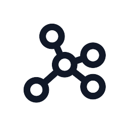
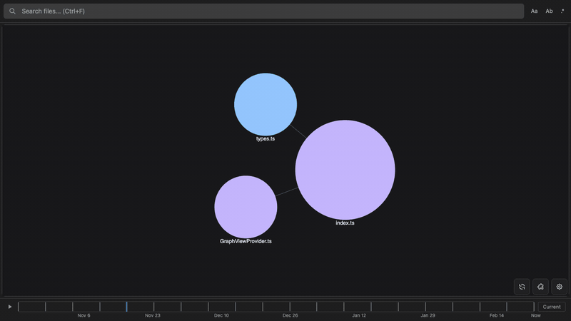
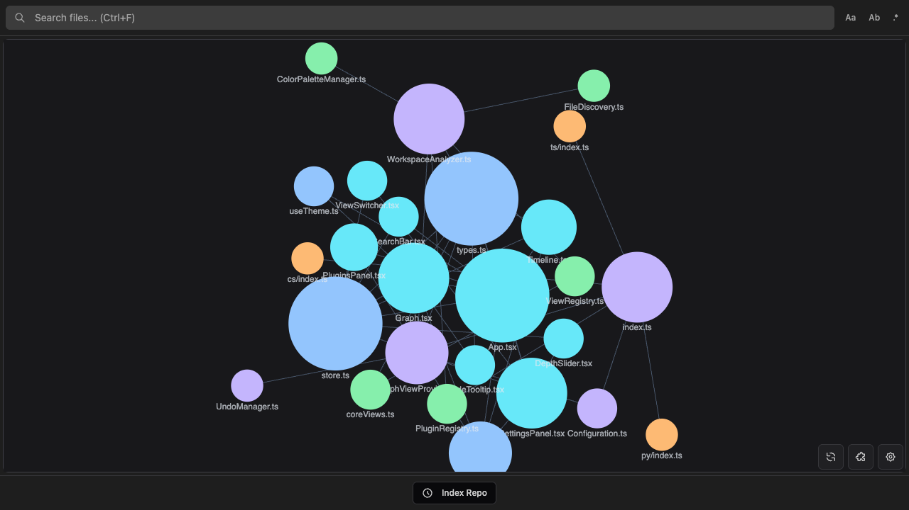

  

<h1 align="center">CodeGraphy</h1>

  Visualize connections

  
  
  
  

  <a href="https://marketplace.visualstudio.com/items?itemName=codegraphy.codegraphy">Core</a>
  ·
  <a href="https://marketplace.visualstudio.com/items?itemName=codegraphy.codegraphy-typescript">TypeScript/JavaScript Plugin</a>
  ·
  <a href="https://marketplace.visualstudio.com/items?itemName=codegraphy.codegraphy-python">Python Plugin</a>
  ·
  <a href="https://marketplace.visualstudio.com/items?itemName=codegraphy.codegraphy-csharp">C# Plugin</a>
  ·
  <a href="https://marketplace.visualstudio.com/items?itemName=codegraphy.codegraphy-godot">GDScript Plugin</a>
  ·
  <a href="https://www.npmjs.com/package/@codegraphy-vscode/plugin-api">Plugin API</a>

CodeGraphy turns file dependencies into an interactive force graph inside VS Code. Files become nodes, imports become edges, and your project's structure becomes something you can inspect, filter, and navigate instead of infer.

## CodeGraphy History

I originally came up with CodeGraphy back in college in 2021 after seeing 's graph. I've always been a very visual thinker and so Obsidians graph felt very intuitive to me. The clusters of nodes that appeared represented bundles of knowledge that was closely entangled. These clusters reminded me of the way that code worked and the way it connecting files (whether importing, extending, referencing). I wanted to see the way the my code naturally connected, just like in Obsidian's graph and see what insights I could learn from it. And thats where CodeGraphy was born.

The first iteration was https://github.com/joesobo/CodeGraphy. Its pretty rough, but the core idea is there. 

V2 was the last published version: https://github.com/joesobo/CodeGraphyV2. This version was a huge upgrade, enabling dynamic physics and a ton more features. But it was largely limited to Javascript

So I started working on V3 https://github.com/joesobo/CodeGraphyV3 this time with a broader scope. Instead of limited ourselves to a single language. Why not use the core of CodeGraphy to render a graph of connections for any language. All you would need to do is write your own plugin that was compatable with the CodeGraphy extension, and you could graph the connections of any language. 

Unfortunetly I got quite busy and never was able to maintain V2 or finish V3.

CodeGraphy V4 is a ground-up for the 4th time. Probably wont be the last time either. This time its been primarly programmed via Codex. Ive followed the same concepts as the previous iterations of CodeGraphy campacted in this monorepo, as a means to test out agentic programming and different methodologies of doing so. This is not a serious project, I am doing this to learn. The project should work but I make no promises. Feel free to fork or look at any of the previous versions if you are interested in the project. Or hell submit an issue or PR.

## Monorepo

- the core extension focused on graph rendering, workspace analysis orchestration, and the VS Code/webview bridge
- example language plugins for:
  - Typescript
  - C#
  - Python
  - Godot
  - Markdown
- typed npm package [`@codegraphy-vscode/plugin-api`](https://www.npmjs.com/package/@codegraphy-vscode/plugin-api)
- quality tooling so refactors can be enforced (based on some of Uncle Bob's ideas):
  - boundaries
  - organize checks
  - mutation testing
  - CRAP
  - SCRAP

## What you get

**A live dependency graph** Open any project and watch it map itself. Files naturally cluster based on their relationships. Drag nodes, zoom in, search, and the graph responds instantly.

**Built-in Markdown support, optional language plugins** The core extension works out of the box for Markdown and MDX. Add TypeScript/JavaScript, Python, C#, and GDScript support as separate CodeGraphy plugin extensions when you want parser-backed dependency detection for those languages.

**Multiple perspectives** Switch between views to inspect the same codebase in different ways:

- **Connections** shows the full dependency graph
- **Depth Graph** radiates outward from a chosen file, 1 to 5 hops deep
- **Folder** traditional file hierarchy view, in graph form

**Git timeline playback** Index your repository history, scrub through commits, and watch the dependency graph evolve over time.

**Configurable graph presentation** Tune the physics, switch between 2D and 3D, adjust node sizes, assign colors with glob patterns, and filter out noise.

| 2D | 3D |
|:--:|:--:|
|  |  |

**Actions from the graph** Open, rename, delete, favorite, and inspect files directly from the graph. Double-click to jump into source. Just like your normal file explorer, anything you can do there you should be able to do here.

## Install

1. Install the [CodeGraphy core extension](https://marketplace.visualstudio.com/items?itemName=codegraphy.codegraphy).
2. Install any language plugins you want.
3. Click the **CodeGraphy** activity bar icon in VS Code.
4. Open the graph and explore.

Want to build your own language plugin? Start with the [Plugin Guide](./docs/PLUGINS.md), the [plugin lifecycle docs](./docs/plugin-api/LIFECYCLE.md), and [`@codegraphy-vscode/plugin-api`](https://www.npmjs.com/package/@codegraphy-vscode/plugin-api).

## Documentation

| | |
|---|---|
| [Timeline](./docs/TIMELINE.md) | Git history playback and scrubbing |
| [Settings](./docs/SETTINGS.md) | Physics, groups, filters, and display options |
| [Commands](./docs/COMMANDS.md) | Command palette reference |
| [Keybindings](./docs/KEYBINDINGS.md) | Keyboard shortcuts |
| [Interactions](./docs/INTERACTIONS.md) | Mouse, context menu, tooltips, and panels |
| [Plugin Guide](./docs/PLUGINS.md) | Build and package plugins for CodeGraphy |
| [Contributing](./CONTRIBUTING.md) | Development setup and contribution workflow |

## License

MIT
