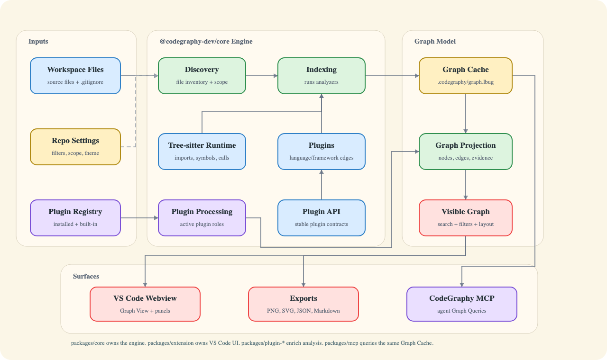

<p align="center">
  
</p>

<h1 align="center">CodeGraphy</h1>

<p align="center">
  A VS Code Relationship Graph for understanding how files and codebase concepts connect.
</p>

<p align="center">
  <a href="https://marketplace.visualstudio.com/items?itemName=codegraphy.codegraphy"></a>
  <a href="https://marketplace.visualstudio.com/items?itemName=codegraphy.codegraphy"></a>
  <a href="https://www.npmjs.com/package/@codegraphy-dev/mcp"></a>
  <a href="https://www.npmjs.com/package/@codegraphy-dev/plugin-api"></a>
  <a href="https://trello.com/b/wG65Lfrb/codegraphy"></a>
</p>

<p align="center">
  <a href="https://marketplace.visualstudio.com/items?itemName=codegraphy.codegraphy">VS Code Extension</a>
  ·
  <a href="https://www.npmjs.com/package/@codegraphy-dev/plugin-typescript">TypeScript/JavaScript Plugin</a>
  ·
  <a href="https://www.npmjs.com/package/@codegraphy-dev/plugin-godot">Godot Plugin</a>
  ·
  <a href="https://www.npmjs.com/package/@codegraphy-dev/plugin-vue">Vue Plugin</a>
  ·
  <a href="https://www.npmjs.com/package/@codegraphy-dev/plugin-svelte">Svelte Plugin</a>
  ·
  <a href="https://www.npmjs.com/package/@codegraphy-dev/mcp">MCP</a>
  ·
  <a href="https://www.npmjs.com/package/@codegraphy-dev/plugin-api">Plugin API</a>
  ·
  <a href="https://www.npmjs.com/package/@codegraphy-dev/graph-renderer">Graph Renderer</a>
</p>

CodeGraphy turns a folder into an interactive Relationship Graph inside VS Code. It starts with File Nodes, then Indexing adds richer Edges from imports, references, calls, tests, folder/package structure, and plugin-provided analysis. The goal is simple: make the relationships between files visible enough that people and agents can navigate a CodeGraphy Workspace without guessing.

This repo is a work in progress and is being built through agentic engineering. It should be useful, but the public surface is still evolving.


## What You Get

| Feature | Why it matters |
|---|---|
| Relationship Graph | See files, folders, packages, plugin nodes, and their Edges in one interactive graph. |
| Symbol Nodes | Expand files into functions, classes, interfaces, types, variables, constants, and plugin-provided declarations when you need code-level context. |
| Search and Filters | Search temporarily, then use persistent Filters to remove generated files, tests, docs, or any other noise from the Visible Graph. |
| Graph Scope | Turn Node Types and Edge Types on or off so the graph matches the question you are asking. |
| Material Icon Theme nodes | File and folder nodes use Material Icon Theme shapes and colors instead of generic dots. |
| VS Code theme integration | Graph surfaces, panels, buttons, text, and directional arrows follow the active VS Code color theme. |
| CSS Snippets | Load workspace-local CSS files from `.codegraphy/settings.json`, then toggle configured snippets from the Themes panel. |
| Custom graph renderer | CodeGraphy's own WebGPU renderer and deterministic WebAssembly physics keep large graphs responsive and configurable. |
| Context actions | Preview, open, reveal, rename, delete, favorite, filter, and export directly from the graph. |
| Graph Cache | Store workspace-local analysis and settings in `.codegraphy/` so graph behavior stays with the CodeGraphy Workspace. |
| CodeGraphy MCP | Let agents index and query nodes, edges, relationships, symbols, and bounded paths through `@codegraphy-dev/core` without focusing VS Code. |

## Gallery

| Search and Filters |
|:--:|
|  |

| Symbol Nodes |
|:--:|
|  |

| Relationship Graph |
|:--:|
|  |

| Large Graphs | Graph Interaction |
|:--:|:--:|
|  |  |

## How It Works



Workspace files and workspace-local settings flow into `@codegraphy-dev/core`. The core package is the central engine: it owns path-based Indexing, built-in Tree-sitter analysis, enabled plugin execution, Graph Cache reads/writes, Graph Query, and the terminal `codegraphy` CLI. It has no VS Code dependency, so the same engine can be reached through the VS Code extension for users, MCP for agents, and Plugin API contracts for plugin authors.

The VS Code extension uses `@codegraphy-dev/core` to build and refresh the workspace Graph Cache, then projects that data into the Visible Graph for the webview, exports, Symbol Nodes, and editor interactions. Language and feature plugins are npm packages loaded through core from the user-level installed-plugin cache and the workspace-local `plugins` array; they are not activated as dependent VS Code extensions. `@codegraphy-dev/mcp` uses the same core APIs for headless agent access: `codegraphy index [workspace]` writes the Graph Cache, Graph Query tools read it, and neither path needs to open or focus VS Code.

The webview renders the Visible Graph through `@codegraphy-dev/graph-renderer`, CodeGraphy's small custom renderer package. It draws with WebGPU and runs fast deterministic force layout and collision physics in WebAssembly. The extension remains the product integration layer: it owns UI, settings, persistence, plugins, selection, hover, picking, and graph controls. The renderer first requests a high-performance WebGPU adapter and can use a fallback WebGPU adapter when the browser provides one; there is no Canvas or WebGL graph fallback when WebGPU is unavailable.

Symbol Nodes are built from indexed declarations and appear alongside file, folder, package, and plugin nodes when you need code-level context. Common kinds include Function, Class, Interface, Type, Struct, Enum, Variable, and Constant. `contains` Edges connect files to their declarations, and symbol-aware relationship Edges show calls, references, inheritance, overrides, imports, and plugin-provided links when analysis can resolve them. Legend defaults style common symbol kinds automatically, custom Legend Entries can target symbol names, kinds, plugin kinds, languages, or containing file paths, and Graph Query/MCP exposes the same symbol payloads to agents.

The editable Excalidraw source for this diagram lives at [docs/media/readme/codegraphy-architecture.excalidraw](./docs/media/readme/codegraphy-architecture.excalidraw).

## Install

### VS Code

1. Install the [CodeGraphy VS Code Extension](https://marketplace.visualstudio.com/items?itemName=codegraphy.codegraphy).
2. Open a workspace in VS Code.
3. Click the CodeGraphy activity bar icon.
4. Open the graph, then run **Index Workspace** when you want semantic relationships beyond discovered files.
5. When you want terminal or plugin management workflows, install the Core Package globally and then install plugin packages.

The VS Code extension bundles `@codegraphy-dev/core` for extension runtime behavior, which already ships built-in coverage for JavaScript, TypeScript, TSX, Python, Go, Haskell, Java, Kotlin, Lua, PHP, Ruby, Rust, Swift, Dart, C#, C, C++, Objective-C, Scala, and Pascal. Objective-C and Scala use native Tree-sitter grammars; Pascal uses a core text-baseline analyzer because the available Tree-sitter package does not ship a usable native binding. It does not install the global terminal `codegraphy` command. Markdown is a real plugin package and is enabled by default for new CodeGraphy Workspaces.

Supported VS Code Marketplace platforms:

| Platform | VSIX target | Support status |
|---|---|---|
| Linux x64 | `linux-x64` | Supported |
| macOS Apple Silicon | `darwin-arm64` | Supported |
| Windows x64 | `win32-x64` | Supported |

Intel macOS (`darwin-x64`), Linux arm64, Windows arm64, and Alpine Linux are
not published targets yet. They should be added only after CodeGraphy has a
matching native runtime package and a platform validation lane for that target.

Plugin management starts from the global Core CLI:

```bash
npm install -g @codegraphy-dev/core
npm install -g @codegraphy-dev/plugin-vue
codegraphy plugins register @codegraphy-dev/plugin-vue
codegraphy plugins enable @codegraphy-dev/plugin-vue
codegraphy index
```

### Agent Access

```bash
npm install -g @codegraphy-dev/mcp
```

Configure your MCP-capable agent to launch `codegraphy-mcp`, then ask something like:

```text
Use CodeGraphy to explain how packages/extension/src/webview/app/shell/view.tsx relates to packages/extension/src/webview/components/graph/viewport/view.tsx.
```

See [MCP Setup](./docs/MCP.md) for agent configuration, JSON examples, and verification prompts.

## CLI Commands

All `codegraphy ...` terminal commands are published by `@codegraphy-dev/core`. The MCP package publishes only the separate `codegraphy-mcp` server command for agent clients.

| Command | What It Does |
|---|---|
| `codegraphy status [workspace]` | Reports fresh, stale, missing, or unusable Graph Cache state for the current folder or explicit CodeGraphy Workspace. |
| `codegraphy index [workspace]` | Runs Indexing for the current folder or explicit CodeGraphy Workspace through `@codegraphy-dev/core`. |
| `codegraphy plugins register <package>` | Registers a globally installed plugin package in the user-level Plugin Registry after validating its CodeGraphy metadata. |
| `codegraphy plugins list [workspace]` | Lists registered plugins and which ones are enabled for one CodeGraphy Workspace. |
| `codegraphy plugins enable <package> [workspace]` | Enables a registered plugin for one CodeGraphy Workspace. |
| `codegraphy plugins disable <package> [workspace]` | Disables a registered plugin for one CodeGraphy Workspace. |

For commands with `[workspace]`, the workspace is an optional trailing positional argument. Omitting the path targets the process current working directory exactly. CodeGraphy does not walk upward to find a parent repo or existing `.codegraphy` folder.

## What Agents Can Query

CodeGraphy MCP is an agent access layer, not a second indexer. It sends explicit Indexing and Graph Query requests to `@codegraphy-dev/core`, reads the same workspace-local Graph Cache as the VS Code extension, and does not need to open or focus VS Code.

| MCP Tool | Agent Can Ask For |
|---|---|
| `codegraphy_status` | Check whether a CodeGraphy Workspace has a fresh, stale, missing, or unusable Graph Cache. |
| `codegraphy_index` | Run explicit Indexing for a CodeGraphy Workspace path. |
| `codegraphy_list_nodes` | List File Nodes, Folder Nodes, Package Nodes, or plugin-added nodes. |
| `codegraphy_list_edges` | List high-level `from` / `to` Edges and grouped Edge Types. |
| `codegraphy_list_relationships` | Inspect relationship evidence grouped by node pair and Edge Type. |
| `codegraphy_list_symbols` | List declarations or symbol-backed relationship evidence. |
| `codegraphy_find_paths` | Find bounded directed paths between exact node paths. |

## Package Map

| Package | Path | Install | What It Owns |
|---|---|---|---|
| `@codegraphy-dev/core` | `packages/core` | `npm install -g @codegraphy-dev/core` | Shared engine package and terminal CLI for Indexing, Graph Cache access, plugin management, and Graph Query execution. |
| CodeGraphy VS Code Extension | `packages/extension` | [VS Code Marketplace](https://marketplace.visualstudio.com/items?itemName=codegraphy.codegraphy) | Graph View, VS Code lifecycle integration, commands, webviews, context menus, and editor integration. |
| `@codegraphy-dev/graph-renderer` | `packages/graph-renderer` | `npm install @codegraphy-dev/graph-renderer` | Custom WebGPU graph drawing and deterministic WebAssembly physics/layout. |
| `@codegraphy-dev/mcp` | `packages/mcp` | `npm install -g @codegraphy-dev/mcp` | Optional agent-agnostic MCP server backed by and dependent on `@codegraphy-dev/core`. |
| `@codegraphy-dev/plugin-api` | `packages/plugin-api` | `npm install @codegraphy-dev/plugin-api` | Typed contracts for external CodeGraphy plugins. |
| `@codegraphy-dev/plugin-typescript` | `packages/plugin-typescript` | `npm install -g @codegraphy-dev/plugin-typescript` | TypeScript and JavaScript ecosystem defaults and enrichment. |
| `@codegraphy-dev/plugin-godot` | `packages/plugin-godot` | `npm install -g @codegraphy-dev/plugin-godot` | Godot project, scene, resource, and script enrichment. |
| `@codegraphy-dev/plugin-markdown` | `packages/plugin-markdown` | installed through `@codegraphy-dev/core` | Markdown wikilink and note relationship enrichment enabled by default for new CodeGraphy Workspaces. |
| `@codegraphy-dev/plugin-vue` | `packages/plugin-vue` | `npm install -g @codegraphy-dev/plugin-vue` | Vue Single-File Component script, type-import, and lazy import enrichment. |
| `@codegraphy-dev/plugin-svelte` | `packages/plugin-svelte` | `npm install -g @codegraphy-dev/plugin-svelte` | Svelte component script, type-import, and lazy import enrichment. |
| `@poleski/quality-tools` | external package | local link until publish | Architecture, coverage-risk, mutation, reachability, and test-shape checks used by this repo through root scripts. |

## Tech Stack

| Area | Stack |
|---|---|
| Monorepo | pnpm workspaces, Turbo, Changesets |
| Core package | TypeScript, Tree-sitter, LadybugDB, headless plugin execution |
| VS Code extension | TypeScript, VS Code Extension API |
| Analysis | Native Tree-sitter plus plugin-provided analyzers |
| Graph storage | LadybugDB-backed `.codegraphy/graph.lbug` Graph Cache |
| Webview | React, Vite, Zustand, Tailwind, Radix/shadcn-owned UI primitives |
| Graph rendering | Custom `@codegraphy-dev/graph-renderer` package using WebGPU and deterministic WebAssembly typed-array physics |
| Theming | VS Code color tokens, Material Icon Theme assets |
| Agent bridge | MCP stdio server from `@codegraphy-dev/mcp` |
| Quality | Vitest, Playwright, ESLint, CRAP, Stryker mutation, repo-owned quality tools |

## Development

```bash
pnpm install
pnpm run build
pnpm run dev
pnpm run test
pnpm run lint
pnpm run typecheck
```

Useful focused commands:

```bash
pnpm run test:unit
pnpm run test:playwright
pnpm run test:vscode
pnpm --filter @codegraphy-dev/extension run test:node
pnpm --filter @codegraphy-dev/extension run test:webview
pnpm --filter @codegraphy-dev/extension exec vitest run --config vitest.config.ts tests/webview/SettingsPanel.test.tsx
```

CI runs build, lint, typecheck, Playwright, and unit tests as independent lanes. Unit tests are split into package Vitest suites, extension node Vitest, and extension webview groups for graph behavior, app/plugins, and panels/search/export behavior. `pnpm run test:vscode` is a local-only VS Code Electron smoke check for the real extension host.

Plugin authors should start with the [Plugin Guide](./docs/PLUGINS.md), the [plugin lifecycle docs](./docs/plugin-api/LIFECYCLE.md), and [`@codegraphy-dev/plugin-api`](https://www.npmjs.com/package/@codegraphy-dev/plugin-api).

## Project State

CodeGraphy V4 is the current monorepo rewrite after earlier experiments in [V1](https://github.com/joesobo/CodeGraphy), [V2](https://github.com/joesobo/CodeGraphyV2), and [V3](https://github.com/joesobo/CodeGraphyV3). The central idea is still the same: code is easier to understand when the relationships between files are visible.

The active roadmap lives on [Trello](https://trello.com/b/wG65Lfrb/codegraphy). GitHub issues are not the primary tracker for this repo right now.

## Documentation

| Doc | Covers |
|---|---|
| [Settings](./docs/SETTINGS.md) | `.codegraphy/settings.json`, panels, and Settings Controls. |
| [Export menu](./docs/INTERACTIONS.md#export) | Graph Export JSON/Markdown/image output plus Index Export symbol JSON. |
| [Commands](./docs/COMMANDS.md) | Command Palette reference. |
| [Keybindings](./docs/KEYBINDINGS.md) | Keyboard shortcuts. |
| [Interactions](./docs/INTERACTIONS.md) | Mouse, context menu, toolbar, and panel behavior. |
| [Plugin Guide](./docs/PLUGINS.md) | Build and package plugins for CodeGraphy. |
| [MCP Setup](./docs/MCP.md) | MCP tools, agent configuration, and verification flow. |
| [MCP Package](./packages/mcp/README.md) | Package-level install, commands, tools, prompts, and skill link. |
| [CodeGraphy MCP Skill](./skills/codegraphy-mcp/SKILL.md) | Reusable skill that teaches agents to use CodeGraphy first for relationship and impact questions. |
| [Contributing](./CONTRIBUTING.md) | Development setup and contribution workflow. |

## License

MIT
