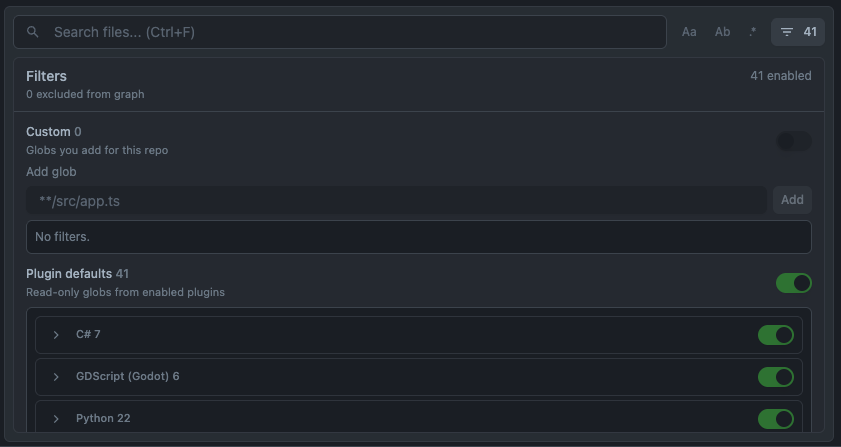
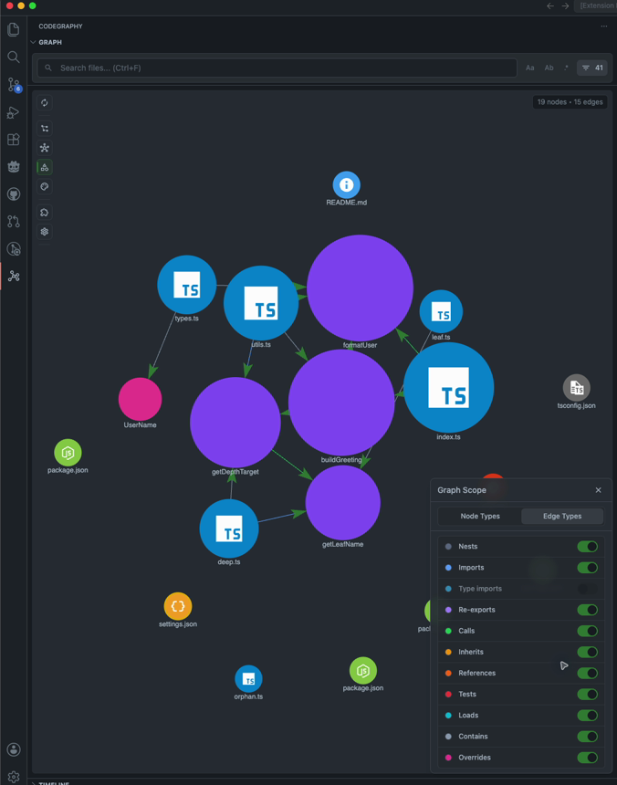
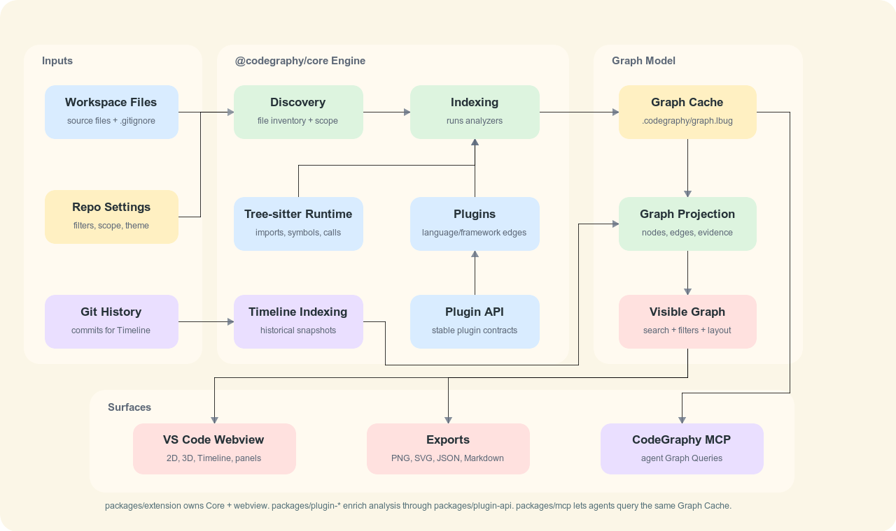

<p align="center">
  
</p>

<h1 align="center">CodeGraphy</h1>

<p align="center">
  An interactive Relationship Graph for exploring how files and code concepts connect.
</p>

<p align="center">
  <a href="https://marketplace.visualstudio.com/items?itemName=codegraphy.codegraphy"></a>
  <a href="https://marketplace.visualstudio.com/items?itemName=codegraphy.codegraphy"></a>
  <a href="https://www.npmjs.com/package/@codegraphy-dev/core"></a>
  <a href="https://www.npmjs.com/package/@codegraphy-dev/tldraw"></a>
  <a href="https://www.npmjs.com/package/@codegraphy-dev/plugin-api"></a>
  <a href="https://discord.gg/Z75vbkt4Ry"></a>
</p>

<p align="center">
  <a href="https://marketplace.visualstudio.com/items?itemName=codegraphy.codegraphy">Install</a>
·
  <a href="./docs/README.md">Docs</a>
·
  <a href="./docs/PHILOSOPHY.md">Philosophy</a>
·
  <a href="./docs/PLUGINS.md">Build a plugin</a>
·
  <a href="./CONTRIBUTING.md">Contribute</a>
·
  <a href="https://discord.gg/Z75vbkt4Ry">Discord</a>
·
  <a href="https://trello.com/b/wG65Lfrb/codegraphy">Roadmap</a>
</p>

CodeGraphy indexes a folder and projects its files and declarations into Nodes. It renders imports, calls, references, inheritance, containment, tests, and plugin-defined Relationships.

Explore the graph in the macOS desktop app, inside VS Code, or as native shapes in tldraw offline. Search, Graph Scope, and persistent filters narrow the VS Code view. The Core engine also supports the terminal CLI and agent queries.


## Community

Join the [CodeGraphy Discord](https://discord.gg/Z75vbkt4Ry) for installation help, product feedback, release announcements, contributor discussion, and community showcases. Use GitHub issues for bugs and work that needs durable tracking.

## Features

| Capability | What it provides |
|---|---|
| Relationship Graph | File, folder, package, Symbol, and plugin-defined Nodes connected by typed Edges. |
| macOS desktop app | A focused File hierarchy, multi-language CodeMirror editor with Markdown preview, and WebGPU Relationship Graph backed by local Core. |
| Search and filters | Temporary search plus workspace-local include and exclude rules. |
| Graph Scope | One panel for Node Type and Edge Type visibility. |
| Symbol Nodes | Functions, classes, interfaces, types, variables, constants, and language-specific declarations. |
| Minimap | A live overview of the current Visible Graph with pointer and keyboard panning. |
| Theming | VS Code theme integration, Material Icon Theme file shapes, Legend Entries, and workspace CSS Snippets. |
| Large-graph renderer | Custom WebGPU drawing with deterministic WebAssembly force and collision physics. |
| Graph actions | Open, reveal, create, rename, delete, favorite, filter, and export from the graph. |
| Graph Cache | Workspace-local SQLite storage shared by the extension and CLI. |
| tldraw interface | A native, editable tldraw canvas with shared force physics and live refresh. |
| Plugins | Headless npm packages for deeper analysis and Graph View contributions. |
| Agent access | Bounded JSON queries through the Core CLI and a reusable Agent Skill source. |

## Gallery

| Large workspace |
|:--:|
|  |

| Search and filters | Symbol Nodes |
|:--:|:--:|
|  |  |

## Install

### macOS desktop app

The Apple Silicon desktop app requires macOS 26 or later. The source, app bundle, DMG path, and release checks are in this repository, but there is no public download yet. Developer ID signing, notarization, and the installed-app acceptance check still gate the first release.

Do not treat an ad-hoc development DMG as a production artifact. See the [desktop app guide](./apps/desktop/README.md) for current behavior and the exact release gate.

### VS Code Extension

1. Install [CodeGraphy from the VS Code Marketplace](https://marketplace.visualstudio.com/items?itemName=codegraphy.codegraphy).
2. Open a folder or workspace.
3. Open CodeGraphy from the Activity Bar.
4. Select **Index Workspace** to add semantic Relationships to the initial file graph.

CodeGraphy requires VS Code 1.101 or newer. Extension users do not need to
install Node.js separately because VS Code provides the Extension host runtime.
If you use an older VS Code release, update VS Code before you update
CodeGraphy.

The extension publishes native runtime targets for Linux x64, macOS Apple Silicon, and Windows x64. It bundles Core and baseline analysis for JavaScript, TypeScript, TSX, Python, Go, Haskell, Java, Kotlin, Lua, PHP, Ruby, Rust, Swift, Dart, C#, C, C++, Objective-C, Scala, and Pascal.

Markdown analysis ships as a bundled plugin. New workspaces enable it by default.

### CLI and Plugins

The CLI, plugins, and interface packages require Node.js `^22.14.0 || >=23.6.0`.
Node.js 20 is not supported. Upgrade Node.js before you update these npm
packages. An active LTS release is recommended, and CodeGraphy does not set a
maximum Node.js version.

```bash
npm install -g @codegraphy-dev/core
cd /path/to/workspace
codegraphy index
codegraphy search SettingsPanel
codegraphy query packages/extension/src/webview/app/shell/view.tsx
codegraphy dependencies packages/extension/src/webview/app/shell/view.tsx
```

Indexing reports when the workspace exceeds its file budget and provides the exact `settings set maxFiles` command needed to expand it. Run `codegraphy watch` in a dedicated terminal when a long-running session needs cached Symbols and Relationships to follow file changes.

Install, register, and enable optional plugins separately:

```bash
npm install -g @codegraphy-dev/plugin-vue
codegraphy plugins register @codegraphy-dev/plugin-vue
codegraphy plugins enable @codegraphy-dev/plugin-vue
codegraphy index
```

Commands target the current directory. Use `-C, --workspace <path>` before the command to select another CodeGraphy Workspace:

```bash
codegraphy -C /path/to/workspace index
```

### tldraw Offline

The first tldraw interface supports macOS and Node.js `^22.14.0 || >=23.6.0`. An active
LTS release is recommended. Install the
[tldraw offline desktop app](https://www.tldraw.com/), Core, and the interface.
Then run the launcher from the workspace to index:

```bash
npm install -g @codegraphy-dev/core @codegraphy-dev/tldraw
cd /path/to/workspace
codegraphy-tldraw
```

The launcher creates or refreshes `CodeGraphy.tldraw`, opens it in tldraw offline, and runs CodeGraphy's WebAssembly force physics on native tldraw shapes. Search file paths from the top of the canvas, or double-click a node to inspect its relationships. Pass a relative or absolute `.tldraw` path to use a named canvas:

```bash
codegraphy-tldraw docs/architecture.tldraw
```

Run the same command after workspace changes. An open canvas updates in place and keeps user-created notes, drawings, media, node positions, sizes, and styles. See the [`@codegraphy-dev/tldraw` guide](./packages/tldraw/README.md) for controls and document behavior.

## CLI Reference

`@codegraphy-dev/core` publishes all `codegraphy ...` commands. Data commands return `{ "ok": true, "command": "...", "data": ... }` on stdout. Failures return `{ "ok": false, "command": "...", "error": ... }` on stderr with a nonzero exit code.

An unhealthy `doctor` result keeps completed checks in `error.details`. Help and version output use plain text.

| Command | Result |
|---|---|
| `codegraphy status` | Reports fresh, stale, or missing Graph Cache state. |
| `codegraphy doctor` | Checks runtime, settings, Graph Cache schema, integrity, foreign keys, counts, and plugin state. |
| `codegraphy index` | Makes the Graph Cache current and reports actionable file-budget truncation. |
| `codegraphy watch` | Keeps cached Symbols and Relationships current and streams JSON Lines lifecycle events. |
| `codegraphy settings [get|set|unset]` | Safely reads or changes validated workspace settings such as `maxFiles`. |
| `codegraphy nodes` | Lists bounded Nodes from saved Graph Scope. |
| `codegraphy search <pattern>` | Finds exact evidence and uses deterministic all-term File ranking for sparse natural multi-term phrases. |
| `codegraphy map <task>` | Builds a compact task-personalized File map with declarations and typed connecting Relationships. |
| `codegraphy query <node>` | Inspects one exact File or Symbol with prioritized declarations and incoming/outgoing Relationships. |
| `codegraphy edges` | Lists bounded Edges. |
| `codegraphy dependencies <node>` | Lists outgoing Relationships for a file or exact Symbol Node. |
| `codegraphy dependents <node>` | Lists incoming Relationships for a file or exact Symbol Node. |
| `codegraphy path <from> <to>` | Finds bounded directed paths. |
| `codegraphy scope` | Reads or changes saved Node Type and Edge Type scope. |
| `codegraphy filter` | Reads or changes persisted filter patterns. |
| `codegraphy plugins` | Registers, links, lists, enables, or disables plugins. |

### Query behavior

- `nodes` and `edges` use saved Graph Scope.
- Search, Map, Target Query, Path, and targeted Relationship commands read complete cached Node and Edge Types unless `--node-type` or `--edge-type` explicitly narrows them.
- `--filter`, `--node-type`, and `--edge-type` are one-command projections; they do not change workspace settings.
- JavaScript and TypeScript reexports remain structural Relationships, so calls through barrels can resolve to implementation Symbols.
- Results are bounded. Use returned pagination and completeness fields instead of assuming omitted results do not exist.

### Live updates and output

`codegraphy watch` performs an initial synchronization and stays in the foreground. It writes one JSON envelope per lifecycle event. It batches workspace changes, skips cache artifacts and active Filter matches, serializes cache writes, and flushes pending work when interrupted.

The VS Code Extension does not start this process. It changes cached source facts only after **Index Workspace** or **Re-index Workspace**.

Other data commands write one JSON envelope to stdout. Failures use stderr and a nonzero exit code; `--verbose` adds diagnostics to stderr. Run `codegraphy <command> --help` for exact arguments, bounds, and examples.

### Agent Skill

The [CodeGraphy Agent Skill](./skills/codegraphy/SKILL.md) explains the Relationship Graph, lifecycle, query surfaces, JSON output, freshness, shaping, and limits so shell-capable agents can choose their own navigation strategy. Install it from a clone of this repo:

```bash
npx skills@latest add ./skills/codegraphy
```

A public `codegraphy/skills` repository will host the skill once published.

## Architecture



`@codegraphy-dev/core` owns File Discovery, built-in analysis, Graph Cache watching, plugin activation, SQLite storage, Graph Query, and the CLI. It does not own rendering.

The macOS desktop app runs Core in a bundled local process and keeps File access and child-process control in Rust. Its webview combines a File hierarchy, CodeMirror, and the existing renderer. The VS Code extension connects Core to the editor lifecycle and React Graph View. The tldraw interface connects Core data and shared physics to native tldraw shapes.

`@codegraphy-dev/graph-renderer` owns product-neutral WebGPU drawing and WebAssembly physics. The private `@codegraphy-dev/graph-visuals` package owns CodeGraphy-specific Node appearance, Material icon matching, connection sizing, and force-control semantics shared by the desktop app and VS Code extension. Core plugins use `@codegraphy-dev/plugin-api`. VS Code Extension plugins use `@codegraphy-dev/extension-plugin-api`.

| Package | Role |
|---|---|
| [`@codegraphy-dev/desktop`](./apps/desktop/README.md) | Tauri macOS app, local Core process boundary, File hierarchy, and editor. |
| [`@codegraphy-dev/core`](./packages/core/README.md) | Shared indexing, cache, plugin, query, and CLI engine. |
| [`@codegraphy-dev/extension`](./packages/extension/docs/README.md) | VS Code host and Graph View product integration. |
| [`@codegraphy-dev/tldraw`](./packages/tldraw/README.md) | macOS launcher and native tldraw offline canvas integration. |
| [`@codegraphy-dev/graph-renderer`](./packages/graph-renderer/README.md) | WebGPU graph renderer and WebAssembly physics. |
| `@codegraphy-dev/graph-visuals` | Private CodeGraphy visual and force-control semantics shared by interfaces. |
| [`@codegraphy-dev/plugin-api`](./packages/plugin-api/README.md) | Public TypeScript contracts for Core plugins. |
| [`@codegraphy-dev/extension-plugin-api`](./packages/extension-plugin-api/README.md) | Public TypeScript contracts for VS Code Extension plugins. |
| `@codegraphy-dev/plugin-*` | Optional plugins for Core or an interface host. |
| [`@codegraphy/web`](./apps/web/README.md) | Account, subscription, billing, and access routes. |

The editable diagram source is [`docs/media/readme/codegraphy-architecture.excalidraw`](./docs/media/readme/codegraphy-architecture.excalidraw).

## Development

```bash
pnpm install
pnpm run build
pnpm run dev
pnpm run test
pnpm run lint
pnpm run typecheck
```

See [Contributing](./CONTRIBUTING.md) for the workflow and [Documentation](./docs/README.md) for the reference map. The active roadmap lives on [Trello](https://trello.com/b/wG65Lfrb/codegraphy).

## License

MIT
