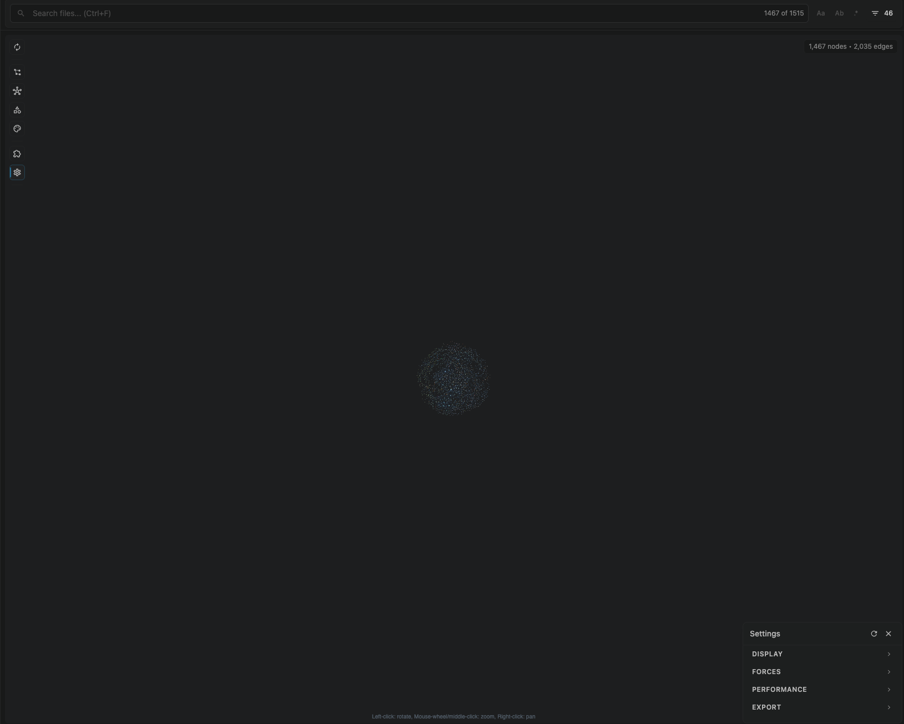

# Settings

CodeGraphy keeps CodeGraphy Workspace settings under `.codegraphy/settings.json`.

- The graph UI writes to that file for you.
- The file is mostly internal, but still human-editable.
- CodeGraphy watches it for changes and updates relevant graph state when it changes.
- `.codegraphy/settings.json` is the source of truth for workspace-local behavior.
- These settings are no longer intended to be managed from VS Code's built-in Settings UI.

Settings do not all trigger the same graph work. Display and projection settings
such as filters, Graph Scope visibility, node colors, edge colors, visual plugin
data, and CSS snippets update the live Graph View from runtime memory without
marking Graph Cache stale. Analyzer plugin settings and discovery settings can
schedule targeted graph work, and explicit Re-index remains the full refresh
path that rebuilds Graph Cache from the current settings.

## Workspace-local settings file

The workspace-local settings file lives at:

```text
.codegraphy/settings.json
```

Common top-level sections include:

- `nodeVisibility`
- `nodeColors`
- `edgeVisibility`
- `edgeColors`
- `legend` (the stored Legend Entry list used by the Legends popup)
- `cssSnippets`
- `plugins`
- `physics`
- `timeline`

Example:

```json
{
  "version": 1,
  "nodeVisibility": {
    "file": true,
    "folder": false,
    "package": false
  },
  "edgeVisibility": {
    "nests": true,
    "import": true,
    "reference": true
  },
  "edgeColors": {
    "import": "#60A5FA",
    "reference": "#F97316"
  },
  "plugins": [
    {
      "id": "codegraphy.markdown",
      "enabled": true
    },
    {
      "id": "codegraphy.vue",
      "enabled": true,
      "options": {
        "includeTests": true
      }
    }
  ],
  "legend": [
    { "id": "tests", "pattern": "*/tests/**", "color": "#22C55E" }
  ],
  "cssSnippets": {
    ".codegraphy/snippets/base-grid.css": true
  },
  "pluginData": {
    "codegraphy.particles": {
      "enabled": true,
      "preset": "embers"
    }
  }
}
```

## Core settings reference

| Setting | Type | Default | Description |
|---------|------|---------|-------------|
| `maxFiles` | number | `1000` | Maximum files to discover/analyze |
| `verboseDiagnostics` | boolean | `false` | Enables CodeGraphy-prefixed support diagnostics in the VS Code Developer Tools console |
| `include` | string[] | `["**/*"]` | Glob patterns for files to include |
| `filterPatterns` | string[] | `[]` | Filter Settings for files to exclude |
| `respectGitignore` | boolean | `true` | Honor `.gitignore` patterns |
| `showOrphans` | boolean | `true` | Keep Orphan Nodes after final graph stages |
| `showLabels` | boolean | `true` | Show file name labels on nodes |
| `bidirectionalEdges` | string | `"separate"` | How to render bidirectional file edges |
| `directionMode` | string | `"arrows"` | Direction indicator mode |
| `directionColor` | string | `"#475569"` | Direction indicator color |
| `particleSpeed` | number | `0.005` | Particle direction speed |
| `particleSize` | number | `4` | Particle size in pixels |
| `favorites` | string[] | `[]` | Favorite file paths |
| `legend` | object[] | `[]` | Stored Legend Entries: `{ id, pattern, color, ... }` |
| `cssSnippets` | object | `{}` | Workspace-relative CSS snippet paths mapped to `true` to load or `false` to keep disabled |
| `plugins` | object[] | `[]` | Workspace Plugin Activity State entries keyed by Plugin ID with explicit `enabled: true/false` intent |
| `pluginData` | object | `{}` | Plugin-owned workspace settings keyed by Plugin ID |
| `nodeVisibility` | object | generated | Graph Scope by Node Type id |
| `nodeColors` | object | generated | Node-type colors by id |
| `edgeVisibility` | object | generated | Graph Scope by Edge Type id |
| `edgeColors` | object | generated | Edge-kind colors by id |
| `physics.*` | object | see file | Force simulation controls |
| `timeline.*` | object | see file | Timeline indexing/playback controls |

## CSS Snippets

CodeGraphy CSS Snippets let a workspace apply small CSS files to the CodeGraphy Extension UI without rebuilding a full VS Code theme.

Create a CSS file inside the CodeGraphy Workspace, usually:

```text
.codegraphy/snippets/base-grid.css
```

Then enable it in `.codegraphy/settings.json`:

```json
{
  "cssSnippets": {
    ".codegraphy/snippets/base-grid.css": true,
    ".codegraphy/snippets/forest.css": false,
    ".codegraphy/snippets/ocean-image.css": true
  }
}
```

The object is the snippet toggle map. A path set to `true` loads into the webview. A path set to `false` stays in settings but does not load. A path that is not included does nothing. Enabled snippets load in object insertion order, so later enabled entries can override earlier enabled entries through the normal CSS cascade.

Path rules:

- Paths are relative to the CodeGraphy Workspace root.
- Paths must end in `.css`.
- Paths must stay inside the CodeGraphy Workspace.
- Absolute paths and `../` parent traversal are rejected.
- Missing, invalid, or rejected paths write `[CodeGraphy]` warnings to the VS Code Developer Tools console.

CodeGraphy watches `.codegraphy/settings.json`, so adding or removing entries updates the loaded snippet list. Editing the contents of an already loaded CSS file does not auto-reload yet; reload the webview or touch the settings file after changing snippet contents.

### Styling Hooks

Snippets should target CodeGraphy Styling Hooks: stable `data-codegraphy-*` attributes exposed by the extension UI. These hooks are the customization contract; avoid targeting generated classes or incidental React wrapper structure.

Common hooks:

| Hook | Values | Surface |
|------|--------|---------|
| `data-codegraphy-view` | `graph`, `timeline` | Webview body |
| `data-codegraphy-surface` | `app`, `graph-view`, `graph-stage`, `timeline-view` | Main view surfaces |
| `data-codegraphy-layer` | `graph-overlay`, `graph-stage-world-overlay`, `graph-stage-viewport-overlay`, `graph-accessibility` | Graph overlay layers |
| `data-codegraphy-region` | `search-header`, `active-file-breadcrumb`, `graph-tool-rail`, `graph-panel-stack`, `graph-corner-controls`, `panel-header`, `panel-body`, `settings-sections`, `theme-sections`, `legend-sections`, `toolbar-actions`, `toolbar-lifecycle`, `toolbar-graph-tools`, `toolbar-system`, `timeline-track-shell`, `timeline-track`, `timeline-axis`, `timeline-playback-buttons`, `timeline-current-date`, `graph-index-progress-track`, `graph-index-progress-fill`, `timeline-progress-track`, `timeline-progress-fill` | Reusable regions inside views and panels |
| `data-codegraphy-panel` | `filters`, `graph-scope`, `themes`, `plugins`, `settings`, `timeline`, `timeline-summary`, `timeline-commits` | Panels |
| `data-codegraphy-control` | `search`, `search-field`, `search-options`, `graph-toolbar`, `display-modes`, `display-depth`, `graph-scope-tabs`, `timeline-playback`, `timeline-track` | Interactive controls |
| `data-codegraphy-section` | `particles`, `legends`, `css-snippets`, `settings-display`, `settings-forces`, `settings-performance`, `settings-export` | Settings and theme sections |
| `data-codegraphy-slot` | `graph-panel`, `node-details`, `graph-toolbar`, `theme-panel`, `toolbar`, `timeline-panel` | Plugin contribution slots |
| `data-codegraphy-state` | `loading`, `empty`, `graph-indexing`, `timeline-indexing`, `timeline-ready-to-index` | View states |
| `data-codegraphy-row` | `plugin`, `css-snippet`, `timeline-commit`, `display-renderer`, `display-direction`, `display-bidirectional` | Repeated rows |
| `data-codegraphy-marker` | `timeline-commit`, `timeline-current-commit` | Timeline markers |

Example:

```css
[data-codegraphy-surface='graph-stage'] {
  background: radial-gradient(circle at top left, rgba(56, 189, 248, 0.18), transparent 32%);
}

[data-codegraphy-panel='graph-scope'] {
  backdrop-filter: blur(12px);
}
```

See `examples/.codegraphy/snippets/` for copyable demo snippets, including a static grid, static forest and ocean UI themes, and a faded ocean image background.

## Particles

The `codegraphy.particles` plugin injects a **Particles** section into the
Theme popup when that plugin is active. The extension does not own these
particles directly; the plugin owns the controls, canvas renderer, presets, and
settings shape.

Particle state is stored in `.codegraphy/settings.json` under
`pluginData["codegraphy.particles"]`:

```json
{
  "pluginData": {
    "codegraphy.particles": {
      "enabled": true,
      "preset": "constellations"
    }
  }
}
```

Built-in presets are `synapse`, `rain`, `constellations`, `perlin-flow`, `leaves`, `sparkles`, `embers`, and `snow`. Use `none` with `enabled: false` to disable the canvas.

Custom particle effects are TypeScript files in `.codegraphy/particles/`.
The Particles plugin compiles them for the Graph View webview and shows them
as custom toggles in the Theme popup. Store the selected effect id in
`customEffectId`:

```json
{
  "pluginData": {
    "codegraphy.particles": {
      "enabled": true,
      "preset": "custom",
      "customEffectId": "fireflies"
    }
  }
}
```

For example, `examples/.codegraphy/particles/fireflies.ts` appears as a
Fireflies toggle when the `examples/` workspace is open. Custom effect files
should export `activateParticleEffect(context)` and may return a cleanup
function.

## Graph Scope settings

Graph Scope writes Node Type visibility to `nodeVisibility` and Edge Type visibility to `edgeVisibility`. These maps store user intent by type id. A key can remain in settings even when the current workspace no longer shows that row; CodeGraphy preserves the saved value so toggles come back with the user's last choice if the relevant language or plugin returns.

Node Type rows are capability-driven:

- `file`, `folder`, and `package` are structural Node Types and are always available in Graph Scope.
- `symbol` and `variable` are parent toggles. They appear only when at least one visible child Node Type belongs under them.
- Child Symbol and Variable rows appear when the active analyzer or plugin declares them relevant for the indexed workspace through Graph Scope capabilities.
- Before a workspace has indexed file paths and Node Type capabilities, Graph Scope shows only structural Node Types.

Edge Type rows follow the same workspace-capability model. Active analyzers and plugins declare which Edge Types are relevant for all indexed files in the workspace, so mixed-language workspaces show the union of relevant controls while single-language workspaces hide impossible controls.

## Timeline settings

| Setting | Type | Default | Description |
|---------|------|---------|-------------|
| `timeline.maxCommits` | number | `500` | Maximum commits to index (10-5000) |
| `timeline.playbackSpeed` | number | `1.0` | Playback speed multiplier (0.1-10.0) |

Timeline indexing also respects the workspace-local filter and plugin settings. See [Timeline](./TIMELINE.md) for details.

## Plugin settings

Plugin enablement is workspace-local. Installing a plugin package only makes it available; enabling it writes Plugin ID activity into the workspace `plugins` array.

First Indexing of a new CodeGraphy Workspace materializes Markdown explicitly:

```json
{
  "plugins": [
    {
      "id": "codegraphy.markdown",
      "enabled": true
    }
  ]
}
```

Setting that entry to `enabled: false` disables Markdown for the workspace. Other registered plugins stay disabled until they are enabled through the VS Code UI, CLI, or MCP. Absence means the plugin has never been toggled in that workspace.

Plugin `options` are also workspace-local. During Indexing, CodeGraphy merges package-level defaults with the workspace entry and passes the result to plugin hooks as `context.options`.

When a plugin package declares `codegraphy.defaultOptions`, enabling that plugin copies those defaults into the workspace entry. That makes the settings explicit and editable:

```json
{
  "plugins": [
    {
      "id": "codegraphy.gdscript",
      "enabled": true,
      "options": {
        "includeSceneResources": true,
        "includeAutoloads": true,
        "includeClassNameUsage": true
      }
    }
  ]
}
```

CLI, MCP, and the VS Code plugin popup should all produce the same workspace shape when they enable the same registered plugin.

## Settings Panel

Open by clicking the gear button in the left toolbar rail. This panel now focuses on physics and graph behavior, while Graph Scope and Legend styling live in their own dedicated panels on the right side.



### Forces

Adjusts the physics simulation in real time.

| Control | Range | Description |
|---------|-------|-------------|
| Repel Force | 0-20 | How strongly nodes push apart. Higher values spread nodes out more. |
| Center Force | 0-1 | Pull toward the viewport center. |
| Link Distance | 30-500 | Preferred distance between connected nodes in pixels. |
| Link Force | 0-1 | How strongly edges pull connected nodes together. |

### Performance

- **Max Files** limits how many files are discovered and analyzed.
- **Verbose Diagnostics** writes factual `[CodeGraphy]` event lines to VS Code Developer Tools for support workflows. It persists as `verboseDiagnostics` in `.codegraphy/settings.json`.

See [Verbose Diagnostics](./DIAGNOSTICS.md) for the VS Code, CLI, and MCP support workflow.


### Legends

Legend Entries now live in the **Themes** panel under the **Legends** section, not inside the settings panel.
The persisted key remains `legend`.

For node styling, the popup is split into these subsections from top to bottom:

1. `Custom`
2. `Plugins`
3. `Material Icon Theme`
4. `Defaults`

`Defaults` contains host entries such as `Files` and `Packages`. `Material Icon Theme` is a bundled, default-enabled plugin that provides file and folder theming through the public Plugin API. Other plugin entries sit above host defaults. Custom Legend Entries sit above both.

Legend styling resolves in this order:

1. core defaults
2. plugin defaults
3. custom Legend Entries

Higher layers override lower ones only for the fields they set. A plugin can override a core node color without replacing the core icon, and a custom Legend Entry can add an icon on top of an existing color choice.

Custom Legend Entries use glob matching and are applied in drag order:

- bottom entry applies first
- top entry applies last
- top entries can override lower entries

Custom Legend Entries can target files, folders, packages, and plugin-added Node Types through one shared priority system.

Symbol nodes are available through Graph Scope as **Symbol**, with **Variable** shown as a dependent Node Type. Turning Symbol off hides symbol-kind and variable rows without erasing their saved on/off state, so turning Symbol back on restores the previous child choices. When Symbol is off, Graph View keeps symbol analysis in the Graph Cache but does not project symbol nodes, `contains` edges, or symbol-to-symbol edges into the graph payload. When Symbol is on, the `contains` Edge Type connects File Nodes to their contained symbol nodes, and symbol-to-symbol relationship edges such as calls, references, imports, and overrides can appear when analysis provides that detail.

Built-in Legend defaults include common symbol kinds such as Function, Class, Interface, Struct, Enum, Type, Variable, and Constant when the current graph contains those symbol kinds. Function covers function-like and method-like declarations. More specific language kinds still appear as Symbol Nodes through the fallback Symbol styling, and users can target them with Custom Legend Entries by symbol kind. Default node Legend entries provide colors directly; use a Custom Legend Entry when you want to override one. Symbol Legend Entries can also scope styling by symbol kind, plugin kind, plugin source, language, and containing file path. The Godot plugin contributes `Plugins` / `Godot` / `class_name` for GDScript `class_name` symbols when those symbols are present, and emits GDScript functions, constants, variables, and enums into the shared symbol-kind defaults. It also contributes plugin-owned Graph Scope rows for Scene, Resource, Autoload, Scene Node, Signal, and Exported Property symbols. In Graph Scope, Godot `class_name` rows are grouped under Variable because they behave like plugin-owned variable-style declarations.

Custom Legend Entry patterns can match symbol IDs, symbol names, symbol kinds, plugin kinds, and containing file paths. For example, a custom node Legend Entry with pattern `Function` can override the default Function symbol color, and `*.ts` can style symbols contained by TypeScript files.

- Enter a glob pattern and choose a color, optional shape, and optional icon, then click Add.
- Click the x button next to a custom Legend Entry to delete it.
- Lower entries apply first, higher entries apply last.
- Drag custom entries to reorder priority.
- Changes sync back to the extension immediately.

Legend colors support opacity. The color popover stores opaque colors as `#RRGGBB` and transparent colors as `rgba(...)`.

Group patterns match by basename or path suffix. Simple extension patterns like `*.ts` match files at any depth, `src/*` matches files directly inside any `src/` folder, and `src/**` matches files at any depth under any `src/` folder.

**Example custom Legend Entries:**
```
Pattern: src/**    Color: #3B82F6        (blue, all source files)
Pattern: *.test.*  Color: #10B981        (green, test files)
Pattern: *.md      Color: rgba(107, 114, 128, 0.65)  (faded documentation)
Pattern: tests/*   Color: #F59E0B        (amber, files directly inside any tests folder)
Pattern: **/*.gd   Color: #478CBF        (Godot symbol file scope)
```

Legend Entry Toggles for `Plugins`, `Material Icon Theme`, and each nested plugin subsection persist in `.codegraphy/settings.json`. Turning a Legend Entry off disables its styling only; matching graph items remain and fall back to lower-priority styling. Collapsed/open subsection state persists in the webview so the panel reopens the way you left it.

To reuse custom Legend Entries across repos or teammates, copy the relevant entries from `.codegraphy/settings.json`:
```json
{
  "legend": [
    { "id": "src", "pattern": "src/**", "color": "#3B82F6" },
    { "id": "docs", "pattern": "*.md", "color": "rgba(107, 114, 128, 0.65)" }
  ]
}
```

### Filters

Controls Filter Settings for durable noise removal. These are applied during File Discovery, not as a temporary Search.

- **Show Orphans** keeps or removes Orphan Nodes after Graph Scope, filtering, search, and view settings have been applied.
- **Max Files** limits how many files are analyzed.
- **Exclude patterns** are Filter Settings for files to remove entirely. Patterns support `matchBase`, so `*.png` excludes PNG files at any depth.

Exclude patterns are appended to the built-in excludes (`node_modules`, `dist`, `build`, etc.).

**Common exclude patterns:**
```
*.png           all PNG images
*.svg           all SVG files
**/*.test.*     all test files
vendor/**       a vendor directory
```

To version-control filter patterns, add them to `settings.json`:
```json
{
  "filterPatterns": ["*.png", "*.svg", "**/*.test.*"]
}
```

### Display

- **Direction** switches between arrows, particles, and none.
- **Direction Color** controls directional indicator color (hex only, `#RRGGBB`).
- **Particle Speed** uses a normalized UI scale from `1` to `10` (mapped to internal `0.0005` to `0.005`).
- **Show Labels** toggles file name labels on nodes. Labels fade in smoothly as you zoom in.
- **Node / edge colors** now live in the **Themes** panel's **Legends** section and are stored under `nodeColors` / `edgeColors`.

Node, edge, Legend, and Plugin Settings Controls are in dedicated toolbar popups. The Graph View no longer switches between separate built-in graph views.

## Graph scope and settings controls

- **Nodes**: choose Graph Scope for File, Folder, Package, Symbol, Variable, and plugin-added Node Types
- **Edges**: choose Graph Scope for indexed workspace Edge Type capabilities, including structural `NESTS`, semantic Edge Types, and plugin-added Edge Types
- **Themes**: edit Legend Entries and their priority in **Legends**, and toggle configured CSS Snippets
- **Plugins**: enable/disable plugins and reorder them
- **Depth Mode**: optional toolbar mode that focuses the Visible Graph around the Focused Node

Fresh CodeGraphy Workspaces default built-in Edge Type scope to **Imports** and **Nests** on, with other built-in Edge Types off. **Nests** edges remain dormant until Folder Nodes are enabled. Package Nodes do not use **Nests** edges. Plugin-contributed Edge Types default off unless the plugin explicitly defines a different `defaultVisible` value. Existing values saved in `.codegraphy/settings.json` remain the expected workspace values and are not migrated to new defaults. Users can enable additional Edge Types from Graph Scope without re-indexing when those relationships are already present in the Graph Cache.

Hover a Graph Scope row to see a short description of what that Node Type or Edge Type means. Rows may include a compact example, such as a file path for File Nodes or a source snippet for an Edge Type. These tooltips explain the meaning of the type only; they do not explain why a contextual toggle is currently visible.

Graph Scope lists Edge Types that are relevant to the indexed workspace. Relevance comes from active Edge Type Capability Providers, such as Core Tree-sitter coverage for detected file extensions and enabled plugins that declare core or plugin-owned edge capabilities. An Edge Type can appear even when the current graph has zero matching edges, because Graph Scope reflects what the indexed workspace can produce rather than only what the latest graph already contains. CodeGraphy decides this Edge Type list from the indexed workspace before Depth Mode, Filter Settings, Search, or other view narrowing changes what is displayed. **References** and structural **Nests** remain available for indexed file graphs. Until a workspace has a Graph Cache, Edge Type controls are visible but disabled with a short indexing tooltip. Any existing Graph Cache enables Edge Type controls, even while Graph Cache Sync catches up.

Disabling a plugin makes that plugin inactive for the workspace graph surface. Its analysis, filter groups, Node Type definitions, Edge Type definitions, Edge Type capabilities, Graph View contributions, toolbar/context/export actions, and webview assets are not used while the plugin is disabled.

When several relevant Edge Types are available, built-in Edge Types keep their common-usefulness order: **Imports**, **References**, **Calls**, **Type imports**, **Inherits**, **Loads**, **Nests**, **Contains**, then **Overrides**. Plugin-contributed Edge Types appear after built-ins unless a later product decision defines plugin grouping.

Graph Cache enrichment follows Graph Scope. CodeGraphy caches baseline file nodes and file-level edges first. Graph View loads that baseline into runtime memory first, then hydrates Symbol or plugin-owned evidence only when a scope toggle needs it. Once a tier has been loaded, CodeGraphy keeps it in runtime memory for faster future toggles even if the scope is turned off again.

Normal file edits patch the changed Graph Cache rows atomically. Re-index is the force-refresh path that rebuilds and replaces the complete Graph Cache with the current settings.

## File discovery settings

### `maxFiles`

Limits the number of files analyzed to prevent performance issues in large repos.

```json
{ "maxFiles": 1000 }
```

When the limit is hit, a warning appears and only the first N files are processed. Use `include` and `filterPatterns` to narrow scope rather than raising this indefinitely.

### `include`

Glob patterns for which files to discover, relative to the workspace root.

```json
{
  "include": ["src/**/*", "lib/**/*"]
}
```

Common patterns:
- `**/*` all files (default)
- `src/**/*` only files in `src/`
- `**/*.ts` only TypeScript files
- `{src,lib}/**/*` multiple directories

### `filterPatterns`

Glob patterns for files to exclude, appended to built-in excludes. Supports `matchBase` so `*.png` matches at any depth.

**Built-in excludes (always applied):**
```
**/node_modules/**
**/dist/**
**/build/**
**/.git/**
**/coverage/**
**/*.min.js
**/*.bundle.js
```

**Adding custom exclusions:**
```json
{
  "filterPatterns": ["*.png", "*.svg", "**/__tests__/**", "vendor/**"]
}
```

Your patterns are merged with the built-ins, so you don't need to repeat them.

If you hand-edit `.codegraphy/settings.json`, CodeGraphy only applies the save when the file is valid JSON. Invalid saves are ignored until the file is fixed.

When older settings contain symbol kinds that are no longer exposed, CodeGraphy prunes those stale Graph Scope and Legend color keys the next time settings are normalized and saved.

### `respectGitignore`

When `true`, reads `.gitignore` and excludes matching files automatically.

```json
{ "respectGitignore": true }
```

### `bidirectionalEdges`

Controls how mutual import relationships (A imports B and B imports A) are drawn.

```json
{ "bidirectionalEdges": "combined" }
```

- `separate` (default): two arrows, one in each direction (overlapping links are automatically curved apart)
- `combined`: a single line with arrowheads on both ends

This setting is also accessible from the Settings panel.

## Example configurations

### Small TypeScript project
```json
{
  "maxFiles": 50,
  "include": ["src/**/*"],
  "showOrphans": false
}
```

### Large monorepo (focus on one package)
```json
{
  "maxFiles": 1000,
  "include": ["packages/my-package/src/**/*"],
  "filterPatterns": ["**/*.test.ts", "**/*.spec.ts"]
}
```

### Source files only, no assets
```json
{
  "include": ["**/*.{ts,tsx,js,jsx}"],
  "filterPatterns": ["**/*.d.ts"]
}
```

### Team-shared Legend Entries
```json
{
  "legend": [
    { "id": "features", "pattern": "src/features/**", "color": "#3B82F6" },
    { "id": "shared",   "pattern": "src/shared/**",   "color": "#8B5CF6" },
    { "id": "tests",    "pattern": "**/*.test.*",      "color": "#10B981" }
  ]
}
```

## Workspace-local vs user-level state

CodeGraphy’s workspace behavior lives under `<workspace-root>/.codegraphy/`.

- `.codegraphy/settings.json` is workspace-local configuration. Teams can commit it when they want shared CodeGraphy behavior.
- `.codegraphy/graph.lbug` is generated Graph Cache output and should stay local by default.
- `~/.codegraphy/plugins.json` is user-level Plugin Registry state and is not part of any source workspace.
- `~/.codegraphy/settings.json` is user-level CodeGraphy default state.

Recommended default `.gitignore` entry:

```gitignore
.codegraphy/*
```

That default keeps generated Graph Cache artifacts, imported icons, and other CodeGraphy-managed files out of source control. If you want to share workspace plugin enablement, filters, Graph Scope, or Legend settings with teammates, add an explicit exception for the settings file:

```gitignore
.codegraphy/*
!.codegraphy/settings.json
```

Do not use `.codegraphy/` if you want to share any files under `.codegraphy/`; ignoring the directory itself prevents Git from re-including files inside it.

## Troubleshooting

**Graph is empty**
1. Check that `include` patterns match your files
2. Verify files aren't excluded by `filterPatterns`, `.gitignore`, or the built-in excludes
3. Make sure `maxFiles` is high enough

**Nodes are all grey**

No Legend Entries are configured. Add them in the **Themes** panel's **Legends** section or directly in `.codegraphy/settings.json`.

**Too many files**
1. Add exclusion patterns in the Filters section or `filterPatterns`
2. Narrow `include` to specific directories
3. Lower `maxFiles`

**Missing relationships**
1. Make sure the file type is covered by core analysis or an enabled plugin. Core covers JavaScript, TypeScript, TSX, Python, Go, Haskell, Java, Kotlin, Lua, PHP, Ruby, Rust, Swift, Dart, C#, C, C++, Objective-C, Scala, and Pascal; plugins add Markdown, GDScript, Vue, Svelte, and other package-owned relationships.
2. Check that imported files are within the `include` patterns
3. `node_modules` imports are intentionally excluded
4. Check `.codegraphy/settings.json` for an unintended disabled plugin, Node Type, or Edge Type
