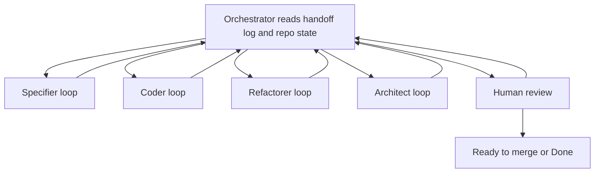

# CodeGraphy Loop

The CodeGraphy Loop is a role based workflow for taking one Trello card, bug
report, or explicit user request from informal intent to a PR that is ready for
human review.

The loop is orchestrated by one main Codex thread. Role agents do focused work,
write structured handoff entries, and return control to the Orchestrator.

## Roles

CodeGraphy uses one Orchestrator and four role agents:

- Orchestrator: owns state, routing, human gates, Trello, PR state, and the
  handoff log.
- Specifier: turns informal intent into an acceptance contract.
- Coder: writes or updates tests and implementation until behavior is green.
- Refactorer: runs quality loops and performs cleanup.
- Architect: handles mutation, architecture review, release hygiene, and final
  CI readiness.

Each role has its own loop contract under `docs/agents/loops/`.

## Heavy Process Host

Heavy focus stealing work should run on the remote Mac mini, not the local
MacBook, unless the user explicitly approves a local run.

This includes:

- VS Code Playwright acceptance runs
- mutation runs
- other long running quality commands that monopolize CPU or steal focus

Use a remote Codex thread on `codegraphy-mini` for these checks. The remote
project path is:

```text
codegraphy-mini:/Users/poleski/Desktop/Projects/CodeGraphyV4
```

The heavy-check thread must verify its host, branch, worktree, and Node runtime
before running commands. Prefer the repo-pinned Node runtime there so remote
checks match local and CI behavior.

When checking or preparing the remote host over SSH, use the Homebrew path for
the repo-pinned Node runtime explicitly so `pnpm` and Codex resolve the same
runtime:

```bash
ssh codegraphy-mini 'export PATH="/opt/homebrew/Cellar/node@22/22.22.2_2/bin:/opt/homebrew/bin:/usr/bin:/bin:/usr/sbin:/sbin"; cd /Users/poleski/Desktop/Projects/CodeGraphyV4; hostname; node --version; pnpm --version; git status --short --branch'
```

Before any heavy command, the remote thread must fetch the branch and use an
isolated remote worktree for the PR branch. The Mac mini checkout may be stale,
so do not assume `/Users/poleski/Desktop/Projects/CodeGraphyV4` is current just
because it exists.

Coder may need the mini for VS Code Playwright acceptance checks. Refactorer may
need it for long quality commands. Architect may need it for mutation, VS Code
Playwright, and final CI reproduction. Record the remote thread, host, command,
and result in the handoff log.

## State Machine



Default route: Specifier, Coder, Refactorer, Architect, Human review.

The orchestrator may route backward after any handoff. A role keeps looping
while it is making measurable progress.

## Orchestrator

The Orchestrator contract lives in `docs/agents/loops/orchestrator.md`.

The Orchestrator owns the detailed handoff format, Trello state, routing,
human gates, and final readiness checks. Role docs own the details of what each
role does once dispatched.

## Commit Policy

Role-owned commits use role prefixes:

```text
specifier: draft graph scope acceptance contract
coder: add graph scope search presets
refactorer: pass organize for graph scope presets
architect: cover graph scope preset mutation survivors
```

Detailed commit timing belongs to each role contract.

## Examples And Docs

Examples belong to the role that owns the reason they are needed:

- Specifier owns example shape because examples usually become the first
  concrete acceptance fixture for the work. It may draft or update example
  source files when examples define the acceptance contract.
- Coder implements production behavior and executable test support needed to
  make the accepted example pass.
- Architect updates release-facing docs, README prose, screenshots, changesets,
  PR body notes, and final example documentation polish.
- Specifier may draft example expectations when they are part of the acceptance
  contract, but human-owned acceptance spec Markdown still requires approval.

The orchestrator decides which role receives example work by reading the card,
handoff log, and current PR state.

## Final Review

Final human review is part of the loop, not an automatic terminal state. The
Orchestrator may move work to human review only after the role contracts have
passed and CI is green. If human review finds an issue, the Orchestrator records
it and routes the loop back to the role that owns the reason.
