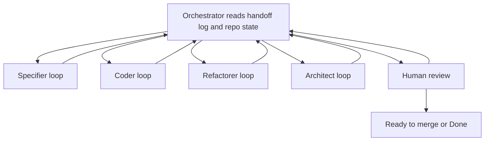

# CodeGraphy Loop

The CodeGraphy Loop is a role based workflow for taking one Trello card, bug
report, or explicit user request from informal intent to a PR that is ready for
human review.

The loop is orchestrated by one main Codex thread. Role agents do focused work,
write structured handoff entries, and return control to the Orchestrator.

## Roles

CodeGraphy uses these four roles:

- Specifier: turns informal intent into an acceptance contract.
- Coder: writes or updates tests and implementation until behavior is green.
- Refactorer: runs quality loops and performs cleanup.
- Architect: handles mutation, architecture review, release hygiene, and final
  CI readiness.

Each role has its own loop contract under `docs/agents/loops/`.

## Heavy Process Host

Heavy focus stealing work should run on the remote Mac mini, not the local
MacBook, unless the user explicitly approves a local run.

This includes:

- VS Code Playwright acceptance runs
- mutation runs
- other long running quality commands that monopolize CPU or steal focus

When a role needs one of these checks, it should run it from a CodeGraphy
worktree on the Mac mini or delegate that exact check to a Codex thread on the
Mac mini. Record the host used in the handoff log.

## State Machine



Default route: Specifier, Coder, Refactorer, Architect, Human review.

The orchestrator may route backward after any handoff. A role keeps looping
while it is making measurable progress.

## Orchestrator Contract

The orchestrator owns:

- reading `AGENTS.md`, `CONTEXT.md`, relevant ADRs, and these loop docs
- working on exactly one Trello card, bug report, or explicit request
- creating a dedicated `codex/` branch, isolated worktree, and draft PR
- keeping one shared PR worktree for the loop
- creating and maintaining `docs/handoff/<trello-card>-<slug>.md`
- routing work to role agents
- enforcing human gates
- preserving the protected main checkout
- moving final work to human review only after each role's conditions pass

The orchestrator should treat Trello as workflow state and the handoff file as
the detailed loop record. The current V0 Trello model is:

- existing `In Progress` state means the loop is running
- `Review` means the loop is waiting for human acceptance review or final
  human review
- existing `Done` means the human has accepted and the work is complete

## Handoff Log

Each loop run must have an append only handoff file in `docs/handoff/`.

Use the Trello card number in the filename when available:

```text
docs/handoff/214-graph-scope-search-presets.md
```

The handoff file must include:

- Trello card or source request
- PR number after one exists
- branch and worktree
- host used for heavy checks
- current state
- human gates
- chronological event log

Role agents report facts. The orchestrator reads the handoff entry, checks the repo and PR state, and routes the next step.

## Human Gates

The loop pauses for human input when:

- a human owned acceptance spec Markdown file needs to be created, edited,
  renamed, or deleted
- the acceptance contract is ambiguous
- a role has three consecutive flat or regressing passes
- a role would need to cross its mandate to proceed
- a tool or environment problem blocks measurable progress
- final human review finds an issue and asks the orchestrator to route it back

The Specifier may draft acceptance changes locally, but it must not commit,
push, or move the loop forward when human owned acceptance spec Markdown is
involved until the user approves the acceptance contract.

## Commit Policy

Role commits use role prefixes:

```text
specifier: draft graph scope acceptance contract
coder: add graph scope search presets
refactorer: pass organize for graph scope presets
architect: cover graph scope preset mutation survivors
```

The Coder commits after focused behavior evidence is green.
The Coder also verifies lint and typecheck before handoff.
The Refactorer commits and pushes after each quality tool or logical quality group is clean.
The Architect may commit and push multiple times while mutation, review, release hygiene, and CI converge.

## Examples And Docs

Examples belong to the role that owns the reason they are needed:

- Specifier owns example shape because examples usually become the first
  concrete acceptance fixture for the work. It may draft or update example
  source files when examples define the acceptance contract.
- Coder implements production behavior and executable test support needed to
  make the accepted example pass.
- Architect updates release-facing docs, README prose, screenshots, changesets,
  PR body notes, and final example documentation polish.
- Specifier may draft example expectations when they are part of the acceptance
  contract, but human-owned acceptance spec Markdown still requires approval.

The orchestrator decides which role receives example work by reading the card,
handoff log, and current PR state.

## Ready For Human Review

The orchestrator may mark the PR ready for human review only when:

- required acceptance decisions are approved
- Coder loop conditions pass
- Refactorer loop conditions pass
- Architect loop conditions pass
- handoff log is current
- PR body is current
- relevant docs and changesets are handled
- PR is pushed
- CI is green, or the remaining CI state is explicitly documented for human
  review

Human review is not terminal by default. If human review finds an issue, the
orchestrator records it in the handoff log and routes work back into the loop.
