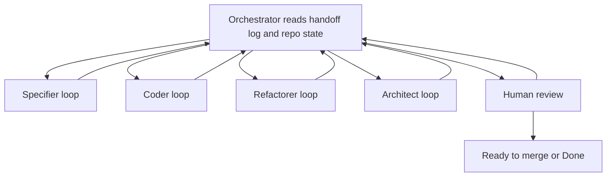

# CodeGraphy Loop

The CodeGraphy Loop is a role-based workflow for taking one Trello card, bug
report, or explicit user request from informal intent to a PR that is ready for
human review.

The loop is orchestrated by one main Codex thread. Role agents do focused work,
write the substantive handoff entries at role boundaries, and return control to
the Orchestrator.

## Roles

CodeGraphy uses one Orchestrator and four role agents:

- Orchestrator: owns state, routing, human gates, Trello, PR state, and keeping
  the handoff current.
- Specifier: turns informal intent into an acceptance contract.
- Coder: writes or updates tests and implementation until behavior is green.
- Refactorer: runs quality loops and performs cleanup.
- Architect: handles mutation, architecture review, release hygiene, and final
  CI readiness.

Each role has its own loop contract under `docs/agents/loops/`.

## Heavy Work

Run focus-stealing work on `codegraphy-mini` unless the user explicitly
approves a local run.

This includes:

- VS Code Playwright acceptance runs
- mutation runs
- long quality commands that monopolize CPU or steal focus

Prepare the mini only when the next role needs it. The remote thread uses the
PR branch in an isolated worktree and verifies GitHub auth before seed-backed
mutation work.

## State Machine



Default route: Specifier, Coder, Refactorer, Architect, Human review.

The orchestrator may route backward after any handoff. A role keeps looping
while it is making measurable progress.

When the orchestrator routes backward, downstream approvals are stale. For
example, routing back to Specifier means the loop must pass through Coder,
Refactorer, and Architect again before returning to human review.

## Commit Policy

Role-owned commits use role prefixes:

```text
specifier: draft graph scope acceptance contract
coder: add graph scope search presets
refactorer: pass organize for graph scope presets
architect: cover graph scope preset mutation survivors
```

Each role contract owns its commit timing. The Orchestrator commits handoff
changes at role boundaries, human gates, public PR or Trello changes, and final
readiness. It does not commit every grill question, internal decision, or status
note.

## Examples And Docs

Examples belong to the role that owns the reason they are needed:

- Specifier owns example shape because examples usually become the first
  concrete acceptance fixture for the work. It may draft or update example
  source files when examples define the acceptance contract.
- Coder implements production behavior and executable test support needed to
  make the accepted example pass.
- Architect updates release-facing docs, README prose, screenshots, changesets,
  PR body notes, and final example polish.
- Specifier may draft example expectations when they are part of the acceptance
  contract, but human-owned acceptance spec Markdown still requires approval.

The orchestrator decides which role receives example work by reading the card,
handoff log, and current PR state.
