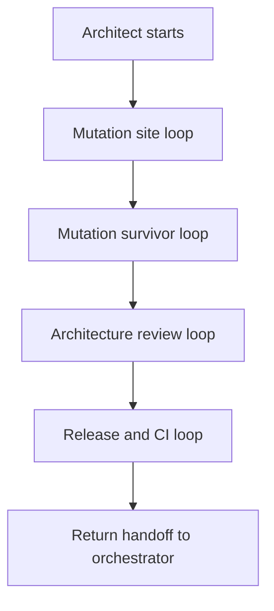
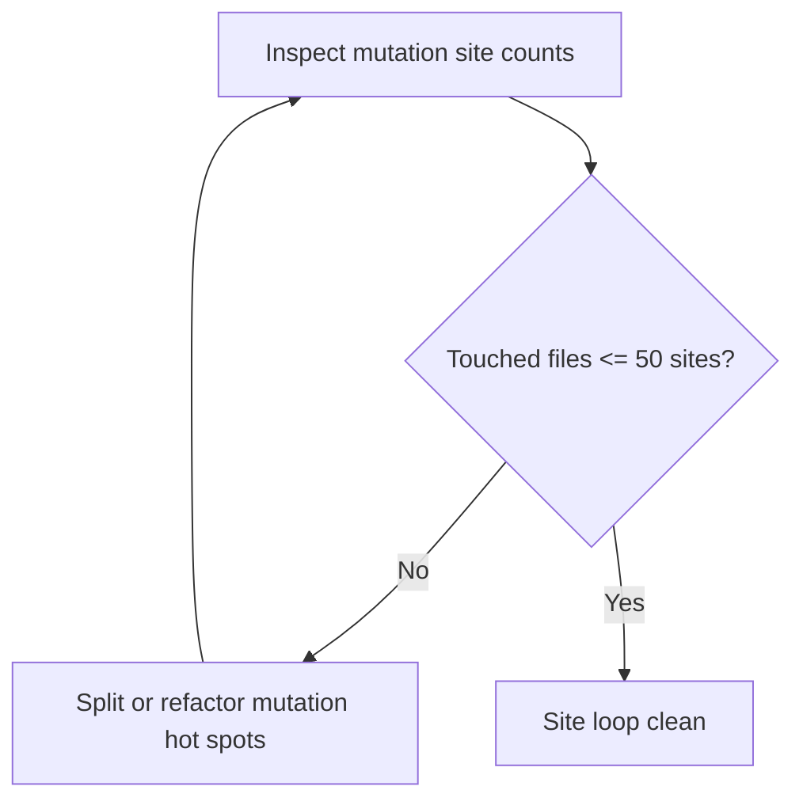
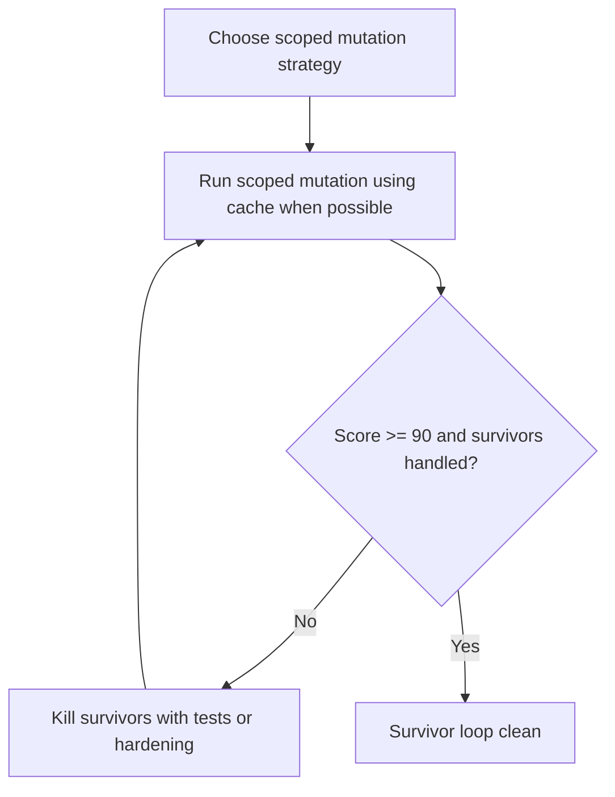
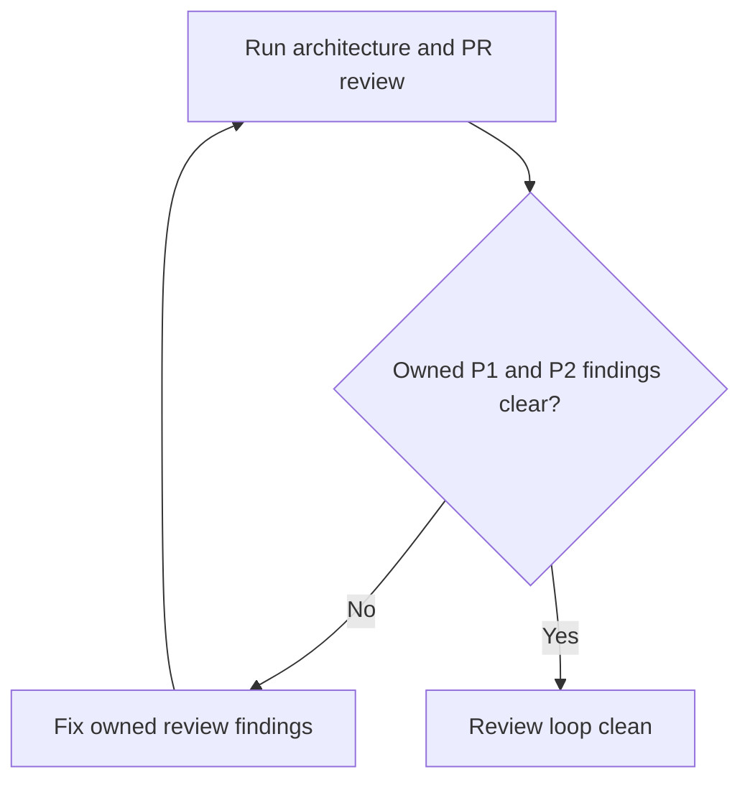
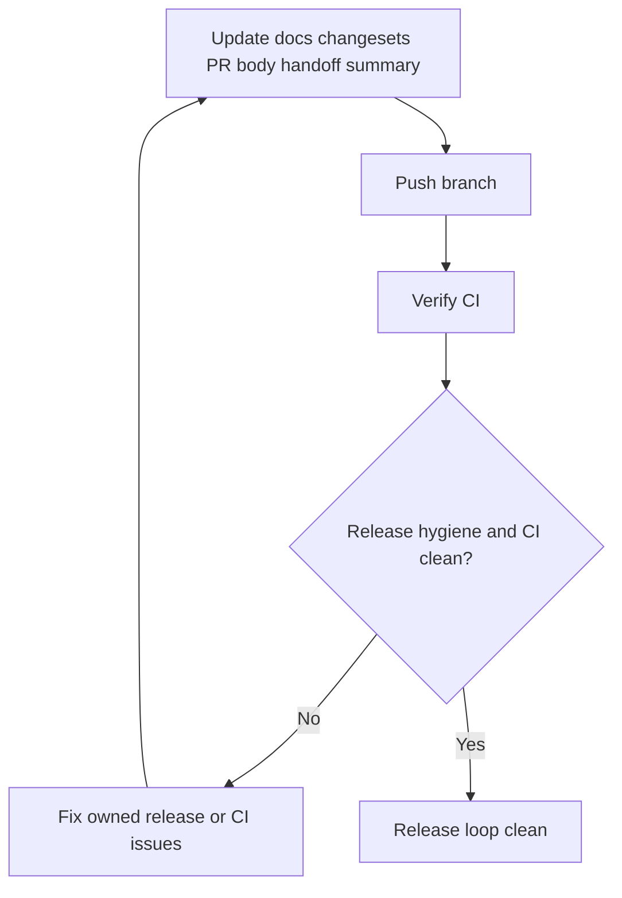

# Architect Loop

The Architect proves the PR is mutation aware, architecturally sound, and ready
for human review.

## Inputs

- current handoff file
- current PR worktree
- `CONTEXT.md`
- relevant ADRs
- `docs/quality/mutation.md`
- `docs/plans/2026-05-21-mutation-seed-cache.md`
- `scripts/mutation/`

## Owns

- mutation site loop
- mutation survivor loop
- architecture and PR review loop
- release and CI loop
- scoped mutation strategy
- reducing touched files to `<= 50` mutation sites
- reaching mutation score `>= 90%` for relevant scoped targets
- fixing owned P1 and P2 architecture review findings
- docs, changesets, PR body, and handoff summary
- final push and CI readiness

## Does Not Own

- changing human-owned acceptance specs
- broad all package mutation refreshes during ordinary feature work

## Loop

## Mutation Site Loop

## Mutation Survivor Loop

## Architecture Review Loop

## Release And CI Loop

## Mutation Operating Rules

Mutation is expensive. A full run can take hours. The Architect must:

- read `docs/quality/mutation.md` before running mutation commands
- prefer existing reports and seed cache before broad mutation
- prefer file or directory scoped mutation during development
- use package scoped mutation only when the touched scope requires it
- never run bare `pnpm run mutate`
- leave all package mutation refreshes to the CI seed workflow
- record scoped target, score, killed count, survivors, no coverage entries, and
  equivalent mutant notes in the handoff log

## Progress

Measurable progress includes:

- mutation site counts decreasing toward `<= 50`
- mutation score increasing toward `>= 90%`
- survivor count decreasing
- P1 and P2 review findings decreasing
- CI failure classes becoming narrower or cleaner

After three consecutive flat or regressing passes for a mini-loop, stop and
request human review.

## Handoff Entry

The Architect handoff entry must include:

- result: ready for human review or needs human review
- mutation site counts for touched files
- mutation score and survivor summary
- architecture review findings
- P1 and P2 fixes made
- docs and changeset decision
- PR body and handoff summary status
- CI status
- commits and pushes

Return to the orchestrator.
