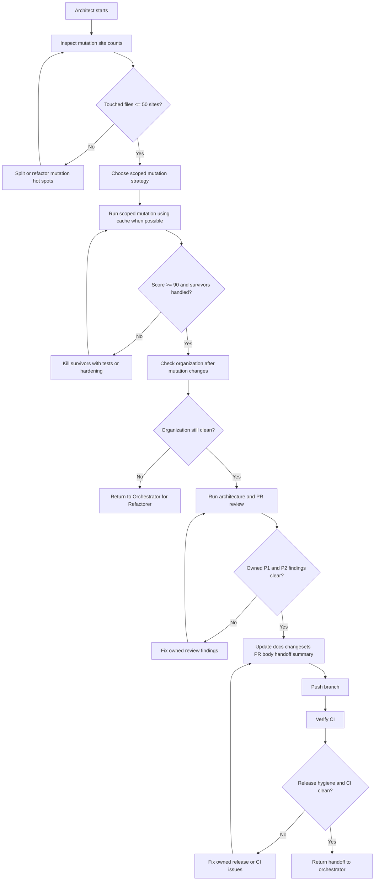

# Architect Loop

The Architect proves the PR is mutation aware, architecturally sound, and ready
for human review.

## Inputs

- current handoff file
- current PR worktree
- `CONTEXT.md`
- relevant ADRs
- `docs/quality/mutation.md`
- `docs/plans/2026-05-21-mutation-seed-cache.md`
- `scripts/mutation/`
- remote Mac mini access for Playwright and mutation checks

## Owns

- mutation site loop
- mutation survivor loop
- architecture and PR review loop
- post-mutation organization check
- release and CI loop
- scoped mutation strategy
- reducing touched files to `<= 50` mutation sites
- reaching mutation score `>= 90%` for relevant scoped targets
- fixing owned P1 and P2 architecture review findings
- docs, changesets, PR body, and handoff summary
- final push and CI readiness

## Does Not Own

- changing human-owned acceptance specs
- changing the accepted behavior or product contract without Orchestrator
  routing
- broad all package mutation refreshes during ordinary feature work

## Loop

## Mutation Operating Rules

Mutation is expensive. A full run can take hours.

The Architect must:

- read `docs/quality/mutation.md` before mutation commands
- run mutation and VS Code Playwright checks on the remote Mac mini unless the
  user explicitly approves a local run
- verify the remote host can access required seed artifacts or GitHub-hosted
  reports before starting a long mutation run that depends on them
- prefer existing reports, seed cache, and file or directory scoped mutation
- if seed artifact auth is unavailable, fall back to direct scoped mutation
  commands before asking for a human environment fix
- never run bare `pnpm run mutate`
- leave all package mutation refreshes to the CI seed workflow
- record scoped target, score, killed count, survivors, no coverage entries, and
  equivalent mutant notes in the handoff log

## Post-Mutation Organization

Mutation survivor fixes often split files, add tests, or move helpers. After
the mutation site and survivor loops pass, check whether the changed production
areas still satisfy the organization tool.

If organization output is dirty, do not start a Refactorer cleanup inside the
Architect thread. Return to the Orchestrator with the affected paths and output
summary. The Orchestrator routes Refactorer, then routes Architect again because
Refactorer changes make the downstream mutation and architecture checks stale.

## Changesets

When a user-facing change needs a changeset, write it as a changelog entry for
users, not as an implementation note.

Each changeset should:

- split distinct user-visible changes into clear entries when one paragraph
  would blur them together
- say what changed
- say how the change affects the user
- use the product language from `CONTEXT.md`
- avoid internal file names, test names, and agent workflow details unless they
  directly affect the user
- read cleanly in the generated changelog without extra context from the PR

## Progress

Measurable progress includes:

- mutation site counts decreasing toward `<= 50`
- mutation score increasing toward `>= 90%`
- survivor count decreasing
- P1 and P2 review findings decreasing
- CI failure classes becoming narrower or cleaner

After three consecutive flat or regressing passes for a mini-loop, stop and
request human review.

Do not ask to stop below the mutation threshold merely because the campaign is
broad, slow, or expensive while the mutation site count, survivor count, or
mutation score is still making measurable progress. Use scoped mutation runs and
cached mutation reports when available. A human stop/continue decision is only
appropriate after the flat-or-regressing threshold is reached, an external
environment blocker prevents meaningful progress, or the next required fix
would cross the Architect mandate.

## Cross Stage Findings

The Architect owns fixing P1 and P2 findings that are inside the architecture,
mutation, release hygiene, or final-readiness mandate.

If a P1 or P2 finding is significant enough to question the accepted behavior,
product contract, or acceptance example, record the finding and return to the
Orchestrator so it can route the loop back to the Specifier.

If a P1 or P2 finding shows the implementation approach is wrong or needs a
behavior-level rewrite, record the finding and return to the Orchestrator so it
can route the loop back to the Coder.

## Handoff Entry

The Architect handoff entry must include:

- result: ready for human review or needs human review
- mutation site counts for touched files
- mutation score and survivor summary
- heavy check host
- architecture review findings
- P1 and P2 fixes made
- docs and changeset decision
- PR body and handoff summary status
- CI status

Return to the orchestrator.
