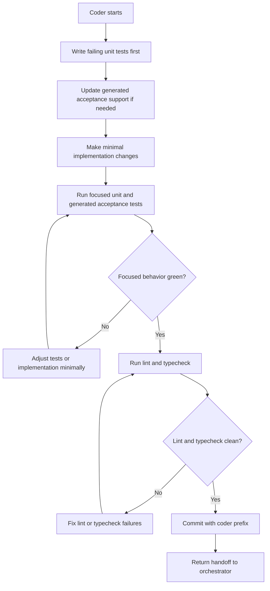

# Coder Loop

The Coder makes the accepted behavior true.

## Inputs

- current handoff file
- accepted acceptance contract or skipped-acceptance rationale
- CodeGraphy domain language from `CONTEXT.md`
- acceptance ownership rules from `docs/agents/acceptance-specs.md`

## Owns

- generated acceptance tests, step bindings, and fixtures
- unit tests
- production and test support needed to make accepted examples pass
- production implementation
- focused behavior fixes
- focused behavior evidence
- lint and typecheck verification before handoff

## Does Not Own

- editing human-owned acceptance spec Markdown
- broad quality tool cleanup
- mutation survivor campaigns
- final architecture review

## Loop

The Coder does not need to check PR CI. It must not hand off until its
focused unit tests, generated acceptance tests, lint, and typecheck pass.

If generated acceptance or focused behavior reds point back to human-owned
acceptance Markdown, stop and return the failing evidence to the Orchestrator.
This includes stale counts, paths, fixture names, visible-control expectations,
or assertions that no longer match the approved behavior.

Run VS Code Playwright checks on the remote Mac mini unless the user approves a
local run.

## Progress

Measurable progress includes:

- failing behavior test becomes passing
- smaller, clearer, or simpler implementation
- more specific executable coverage
- fewer focused test failures
- fewer lint or typecheck failures

After three consecutive flat or regressing passes, stop and request human
review.

## Handoff Entry

The Coder handoff entry must include:

- result: behavior green or needs human review
- files changed
- focused test evidence
- lint and typecheck evidence
- heavy check host, when applicable

Return to the orchestrator.
