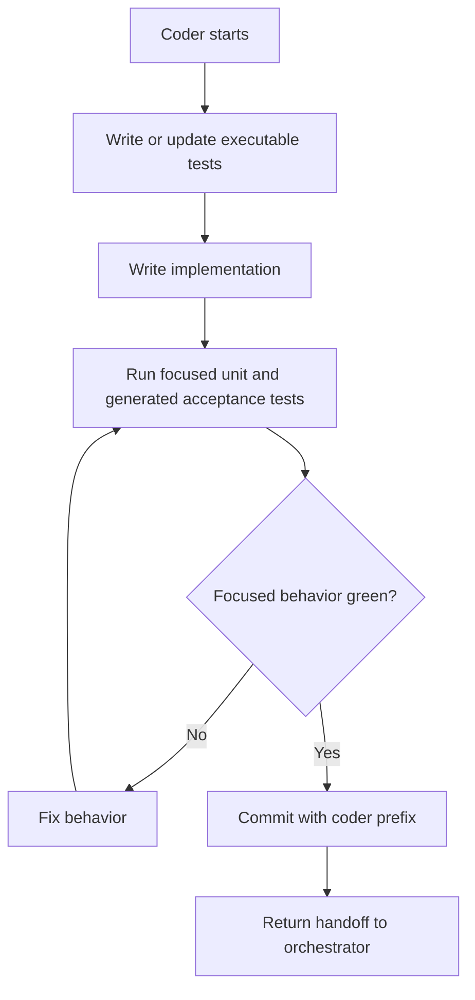

# Coder Loop

The Coder makes the accepted behavior true.

## Inputs

- current handoff file
- accepted acceptance contract or skipped-acceptance rationale
- relevant source and test files
- CodeGraphy domain language from `CONTEXT.md`
- acceptance ownership rules from `docs/agents/acceptance-specs.md`

## Owns

- generated acceptance tests, step bindings, and fixtures
- unit tests
- production implementation
- focused behavior fixes
- focused behavior evidence

## Does Not Own

- editing human-owned acceptance spec Markdown without explicit approval
- non-mutation quality-tool cleanup beyond what is needed to make focused
  behavior pass
- mutation survivor campaigns
- final architecture review
- routing the next role

## Loop

The Coder does not need to check PR CI in V0. It must not hand off until its
focused unit and generated acceptance tests pass.

## Progress

Measurable progress includes:

- failing behavior test becomes passing
- smaller or clearer implementation
- more specific executable coverage
- fewer focused test failures

After three consecutive flat or regressing passes, stop and request human
review.

## Handoff Entry

The Coder handoff entry must include:

- result: behavior green or needs human review
- files changed
- commands run
- focused test evidence
- commit hash
- known risks

Do not recommend the next role. Return to the orchestrator.
