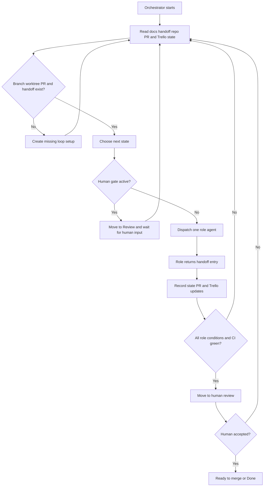

# Orchestrator Loop

The Orchestrator runs one CodeGraphy Loop for one Trello card, bug report, or
explicit user request. It owns state and routing. It does not do role work that
belongs to the Specifier, Coder, Refactorer, or Architect.

## Inputs

- Trello card, bug report, or explicit user request
- `AGENTS.md`
- `CONTEXT.md`
- relevant ADRs and domain docs
- `docs/agents/codegraphy-loop.md`
- role contracts under `docs/agents/loops/`
- current handoff file, if one exists
- current branch, worktree, PR, and CI state

## Owns

- working on exactly one card, bug report, or request
- creating a dedicated `codex/` branch, isolated worktree, and draft PR
- keeping one shared PR worktree for the loop
- creating and maintaining `docs/handoff/<trello-card>-<slug>.md`
- dispatching role agents with a bounded task and the current handoff state
- reading each role handoff before choosing the next state
- preparing or delegating the remote Mac mini worktree before heavy checks
- enforcing human gates
- preserving the protected main checkout
- keeping Trello and PR state aligned with the loop state
- moving final work to human review only after each role's conditions pass

## Does Not Own

- editing human-owned acceptance spec Markdown
- implementing accepted behavior
- running role-owned quality or mutation loops
- bypassing a role because the next step seems obvious
- marking work done before human review accepts it

## Loop



## Routing

Default route:

```text
Specifier -> Coder -> Refactorer -> Architect -> Human review
```

The Orchestrator may route backward after any handoff, but it should preserve
the default route unless the handoff log, repo state, CI state, or human input
shows a reason to move elsewhere.

Common routing examples:

- human-owned acceptance spec needs approval: pause for human review
- acceptance contract is unclear: Specifier
- focused behavior tests fail: Coder
- lint, typecheck, CRAP, organize, boundaries, reachability, or SCRAP fail:
  Refactorer
- mutation sites, mutation survivors, architecture review, release docs,
  changesets, PR body, or final CI fail: Architect
- significant P1/P2 architecture finding changes the accepted behavior or
  product contract: Specifier
- significant P1/P2 architecture finding shows the implementation approach is
  wrong: Coder
- final human review finds an issue: route to the role that owns the reason

Role agents report facts and evidence. They do not choose the next role.

## Remote Heavy Checks

The Orchestrator owns making the remote heavy-check path usable for the loop.
The user should not need to manually set up the Mac mini for each card.

When a role needs VS Code Playwright, mutation, or another long focus-stealing
command, the Orchestrator should either start a remote Codex thread on
`codegraphy-mini` or verify the remote host over SSH before dispatching the role.

Use this sanity check before remote heavy work:

```bash
ssh codegraphy-mini 'export PATH="/opt/homebrew/Cellar/node@22/22.22.2_2/bin:/opt/homebrew/bin:/usr/bin:/bin:/usr/sbin:/sbin"; cd /Users/poleski/Desktop/Projects/CodeGraphyV4; hostname; node --version; pnpm --version; git status --short --branch'
```

The remote work must:

- use the repo-pinned Node PATH above
- fetch the PR branch before running commands
- run from an isolated remote worktree for that branch
- record the remote host, worktree, command, and result in the handoff log
- return findings through the handoff log, not through an unrecorded side
  conversation

If the remote repo, runtime, or worktree is not ready, the Orchestrator fixes or
delegates that setup as part of the loop before the role runs heavy commands.

## Handoff Management

The Orchestrator creates and maintains an append-only handoff file under
`docs/handoff/`.

Use the Trello card number in the filename when available:

```text
docs/handoff/214-graph-scope-search-presets.md
```

The handoff file must include:

- Trello card or source request
- PR number after one exists
- branch and worktree
- host used for heavy checks
- current state
- human gates
- chronological event log

Each dispatch entry should include:

- timestamp
- source and target
- reason for dispatch
- input scope
- expected role output
- human gates that apply

Each received role entry should include:

- role result
- files changed
- commands run
- evidence
- commits and pushes
- host used for heavy checks
- blockers or human decisions needed

The Orchestrator should keep the current state near the top of the handoff file
and append the full event history below it.

## Human Gates

The Orchestrator pauses the loop when:

- human-owned acceptance spec Markdown needs approval
- a role reports three consecutive flat or regressing passes
- a role would need to cross its mandate
- tool or environment state blocks measurable progress
- final human review requests changes

While paused, Trello should move to `Review`. When the user responds, the
Orchestrator records the decision and routes the loop back to the correct role.

The current V0 Trello model is:

- existing `In Progress` state means the loop is running
- `Review` means the loop is waiting for human acceptance review or final
  human review
- existing `Done` means the human has accepted and the work is complete

## Ready For Human Review

The Orchestrator may move the card or PR to human review only when:

- required acceptance decisions are approved
- Specifier conditions are satisfied or explicitly skipped
- Coder conditions pass
- Refactorer conditions pass
- Architect conditions pass
- handoff log is current
- PR body is current
- docs and changesets are handled
- branch is pushed
- CI is green

Human review is a state in the loop. If human review finds an issue, record it
in the handoff log and route back into the loop.
