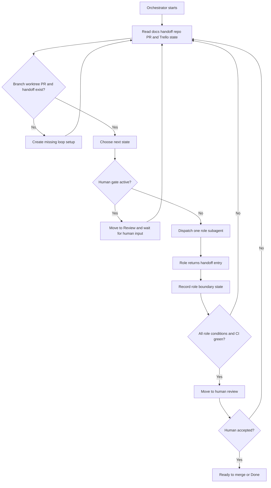

# Orchestrator Loop

The Orchestrator runs one CodeGraphy Loop for one Trello card, bug report, or
explicit user request. It owns state and routing. It does not do role work that
belongs to the Specifier, Coder, Refactorer, or Architect.

## Inputs

- Trello card, bug report, or explicit user request
- `AGENTS.md`
- `CONTEXT.md`
- relevant ADRs and domain docs
- `docs/agents/codegraphy-loop.md`
- role contracts under `docs/agents/loops/`
- current handoff file, if one exists
- current branch, worktree, PR, and CI state

## Owns

- working on exactly one card, bug report, or request
- creating a dedicated `codex/` branch, isolated worktree, and draft PR
- keeping one shared PR worktree and one handoff file for the loop
- dispatching one in-thread Codex subagent for the selected role step
- reading each role handoff before choosing the next state
- preparing the remote Mac mini only when a role needs heavy checks
- enforcing human gates
- preserving the protected main checkout
- keeping Trello and PR state aligned with the loop state
- moving final work to human review only after each role's conditions pass

## Does Not Own

- editing human-owned acceptance spec Markdown
- implementing accepted behavior
- running role-owned quality or mutation loops
- bypassing a role because the next step seems obvious
- taking over the details of role-owned work after dispatch
- marking work done before human review accepts it
- writing role evidence that belongs to the active role subagent

## Loop



## Routing

Default route:

```text
Specifier -> Coder -> Refactorer -> Architect -> Human review
```

The Orchestrator may route backward after any handoff, but should preserve
the default route unless the handoff log, repo state, CI state, or human input
shows a reason to move elsewhere.

When the Orchestrator routes backward, every downstream role state becomes
stale. Route forward again from that point before returning to human review.

Dispatch the selected role as an in-thread Codex subagent using the matching
role setup when one exists. The dispatch includes the role name, bounded task,
role contract, current handoff state, worktree, PR, branch, and stopping
condition. After dispatch, the Orchestrator waits for the role handoff and
continues only orchestration duties.

Keep continuity through the handoff file. When the loop returns to a role, give
the next role subagent the prior handoff entries for that role, the current
state, and the reason the Orchestrator routed back.

Before dispatching a role, verify that the shared worktree is clean or that any
dirty files are intentionally owned by the target role or an active human gate.

Common routing examples:

- human-owned acceptance spec needs approval: pause for human review
- acceptance contract is unclear: Specifier
- focused behavior tests fail: Coder
- lint, typecheck, CRAP, organize, boundaries, reachability, or SCRAP fail:
  Refactorer
- mutation sites, mutation survivors, architecture review, release docs,
  changesets, PR body, or final CI fail: Architect
- post-mutation organization output is dirty: Refactorer, then Architect again
- significant P1/P2 architecture finding changes the accepted behavior or
  product contract: Specifier
- significant P1/P2 architecture finding shows the implementation approach is
  wrong: Coder
- final human review finds an issue: route to the role that owns the reason

Role subagents report facts and evidence. The Orchestrator chooses the next
role.

## Remote Heavy Checks

The user should not need to manually set up the Mac mini for each card.

Prepare the Mac mini lazily. Do not sync or create the remote worktree for every
role. When a role needs VS Code Playwright, mutation, or another long command,
the Orchestrator starts or verifies a remote Codex thread on `codegraphy-mini`
before dispatching that role.

Remote work must:

- fetch the PR branch before running commands
- run from an isolated remote worktree for that branch
- verify GitHub auth before mutation commands that depend on seed artifacts or
  GitHub-hosted reports

If GitHub auth is missing, use direct scoped mutation when possible. Pause only
when the cached artifact is required, and include the exact auth failure and
command that needs auth.

If the remote repo, toolchain, or worktree is not ready, fix or delegate that
setup before the role runs heavy commands.

## Handoff Management

The Orchestrator creates an append-only handoff file under `docs/handoff/`.

Use the Trello card number in the filename when available:

```text
docs/handoff/214-graph-scope-search-presets.md
```

It includes:

- Trello card or source request
- PR number after one exists
- branch and worktree
- current state
- human gates
- chronological event log

Small Orchestrator entries record:

- timestamp
- state changes
- role subagent dispatches
- human gates
- public PR or Trello state changes

Role entries carry detailed evidence:

- role result
- files changed
- evidence
- host used for heavy checks
- blockers or human decisions needed

Keep the current state near the top and append event history below it. The
handoff is a role boundary log, not a transcript. Commit it when dispatching a
role, receiving a role handoff, entering or leaving a human gate, changing
public PR or Trello state, or finishing the loop.

## Human Gates

The Orchestrator pauses the loop when:

- human-owned acceptance spec Markdown needs approval
- a role reports three consecutive flat or regressing passes
- a role would need to cross its mandate
- tool or environment state blocks measurable progress
- final human review requests changes

While paused, Trello should move to `Review`. When the user responds, the
Orchestrator records the decision and routes the loop back to the correct role.

The current Trello model is:

- existing `In Progress` state means the loop is running
- `Review` means the loop is waiting for human acceptance review or final
  human review
- existing `Done` means the human has accepted and the work is complete

## Ready For Human Review

The Orchestrator may move the card or PR to human review only when:

- required acceptance decisions are approved
- Specifier conditions are satisfied or explicitly skipped
- Coder conditions pass
- Refactorer conditions pass
- Architect conditions pass
- handoff current state is accurate
- PR body is current
- docs and changesets are handled
- branch is pushed
- CI is green

Human review is a state in the loop. If human review finds an issue, record it
in the handoff log and route back into the loop.
