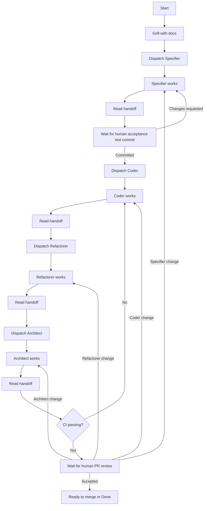

# Orchestrator Loop

The Orchestrator runs one CodeGraphy workflow for a Trello card, bug report, or explicit user request. It owns the loop state, handoff continuity, and routing between role subagents. It does not do Specifier, Coder, Refactorer, or Architect work itself.

The Orchestrator keeps the shared branch, worktree, draft PR, and handoff file coherent while the roles work. It enforces human gates, preserves the protected main checkout, and sends the work to human review only after the role sequence and CI are complete.

It should not implement accepted behavior, run quality loops that belong to a role, take over a role after dispatch, bypass a role because the next step seems obvious, or mark the work done before human review accepts it.

The roles stay intentionally small. The Specifier turns the request into an acceptance contract. The Coder makes the accepted behavior work. The Refactorer cleans up structure and quality failures. The Architect checks the larger shape, mutation confidence, release hygiene, and final readiness.

## Setup

Start by grounding the loop in the request, `AGENTS.md`, `CONTEXT.md`, `docs/agents/acceptance-specs.md`, the relevant role docs, the Trello card and comments, related source files, current PR and CI state, and any existing handoff notes.

Create the dedicated `codex/` branch, isolated worktree, draft PR, handoff file, and Trello breadcrumbs before the first role dispatch. Set up the Mac mini early enough that the loop can offload heavy or focus stealing work when needed. It is mainly for slower checks such as VS Code Playwright, mutation, or long quality commands, so do not use it for routine local work just because it exists.

The handoff is the loop state. Record the setup context there before moving into the grill-with-docs alignment loop.

## Loop



The normal route is:

```text
Grill with docs -> Specifier -> human acceptance test commit -> Coder -> Refactorer -> Architect -> CI -> human PR review
```

Run `grill-with-docs` before the first role dispatch.

After the Specifier returns, pause for the human's acceptance test commit. If the human requests acceptance changes, route back to the existing Specifier lane. Once the human commits the tests, dispatch the Coder.

After the Architect returns, verify CI before human PR review. If CI fails, route back to the existing Coder lane for fixes. If human PR review asks for changes, route back to the role that owns the reason, then move forward through the remaining roles again before returning to review.

Role subagents report facts and evidence. The Orchestrator reads the handoff, chooses the next state, and keeps the PR state aligned with the loop.

## Dispatch

Dispatch the selected role in the current Codex thread. There can only be one active subagent for each role at a time: one Specifier, one Coder, one Refactorer, and one Architect. If the loop routes back to a role, continue that role lane instead of starting a second copy of it.

Read both the repo role contract under `docs/agents/loops/` and the matching Codex role setup under `/Users/poleski/.codex/agents/*.toml`. Include the role name, bounded task, role contract, current handoff state, worktree, branch, PR, and stopping condition.

Before dispatching a role, make sure the shared worktree is clean or that any dirty files are intentionally owned by the target role or an active human gate. When routing back to a role, give that role the prior handoff entries, current state, and the reason for the return.

Remote work should run from an isolated worktree for the PR branch.

Role commits use role prefixes, for example:

```text
specifier: draft graph scope acceptance contract
coder: add graph scope search presets
refactorer: pass organize for graph scope presets
architect: cover graph scope preset mutation survivors
```

Each role owns its own commit timing. The Orchestrator commits handoff changes at role boundaries, human gates, public PR, and final readiness.

## Handoff

Create one append only handoff file under `docs/handoff/`, using the Trello card number when available:

```text
docs/handoff/214-graph-scope-search-presets.md
```

The handoff is the source of truth for loop state. Keep the current state near the top and append concise event history below it. It should show the source request or card, PR number, branch, worktree, context read, human gates, grill-with-docs decisions, role dispatches, role returns, CI state, and public PR or Trello state changes.

Most substantive handoff content comes from the role subagents. They record their result, files changed, commands run, host used for heavy checks, blockers, and any human decision needed. The Orchestrator writes shorter entries for setup, routing, human decisions, and public state changes.

Commit the handoff when dispatching a role, receiving a role handoff, entering or leaving a human gate, changing public PR or Trello state, or finishing the loop.

## Human Review

Pause when the loop needs a human decision: acceptance Markdown or acceptance tests need approval, a role would have to cross its mandate, tooling blocks progress, repeated role passes stop improving, or PR review asks for changes.

While paused, move Trello to `Review`. When the human responds, record the decision in the handoff and route back to the correct role or forward to the next state.

In the current Trello model, `In Progress` means the loop is running, `Review` means the loop is waiting for a human gate, and `Done` means the human has accepted the work.

Move the card or PR to human review only when acceptance decisions are approved, Specifier, Coder, Refactorer, and Architect conditions are satisfied or explicitly skipped, the handoff and PR body are current, docs and changesets are handled, the branch is pushed, and CI is green.

Human review is still part of the loop. If review finds an issue, record it in the handoff, route back to the owning role, and continue from there.
