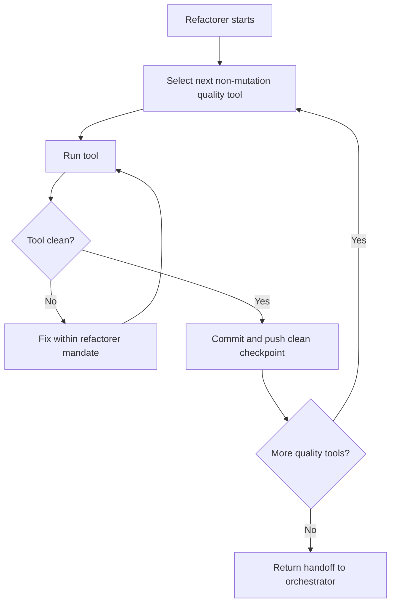

# Refactorer Loop

The Refactorer makes non-mutation quality gates clean while preserving accepted
behavior.

## Inputs

- current handoff file
- current PR worktree
- focused behavior evidence from the Coder
- `docs/quality/`
- relevant package scripts

## Owns

- `pnpm run organize`
- `pnpm run boundaries`
- `pnpm run reachability`
- `pnpm run scrap`
- `pnpm run crap`
- `pnpm run lint`
- `pnpm run typecheck`
- behavior-preserving cleanup
- duplication cleanup
- CRAP risk reduction to `<= 8`
- committing and pushing clean quality checkpoints

## Does Not Own

- mutation survivor campaigns
- changing accepted behavior
- changing human-owned acceptance specs
- final architecture review
- routing the next role

## Loop

The Refactorer should continue through the quality sequence without waiting for
CI after every push. It should not knowingly hand off broken work.

## Progress

Measurable progress includes:

- tool failure count decreasing
- CRAP score decreasing toward `<= 8`
- duplication or dead-surface findings decreasing
- lint/typecheck errors decreasing
- quality output becoming easier to explain

After three consecutive flat or regressing passes for a tool, stop and request
human review.

## Handoff Entry

The Refactorer handoff entry must include:

- result: quality green or needs human review
- tool loops completed
- commands run
- output summaries and report paths
- files changed
- commits and pushes
- any CI state observed after pushes

Do not recommend the next role. Return to the orchestrator.
