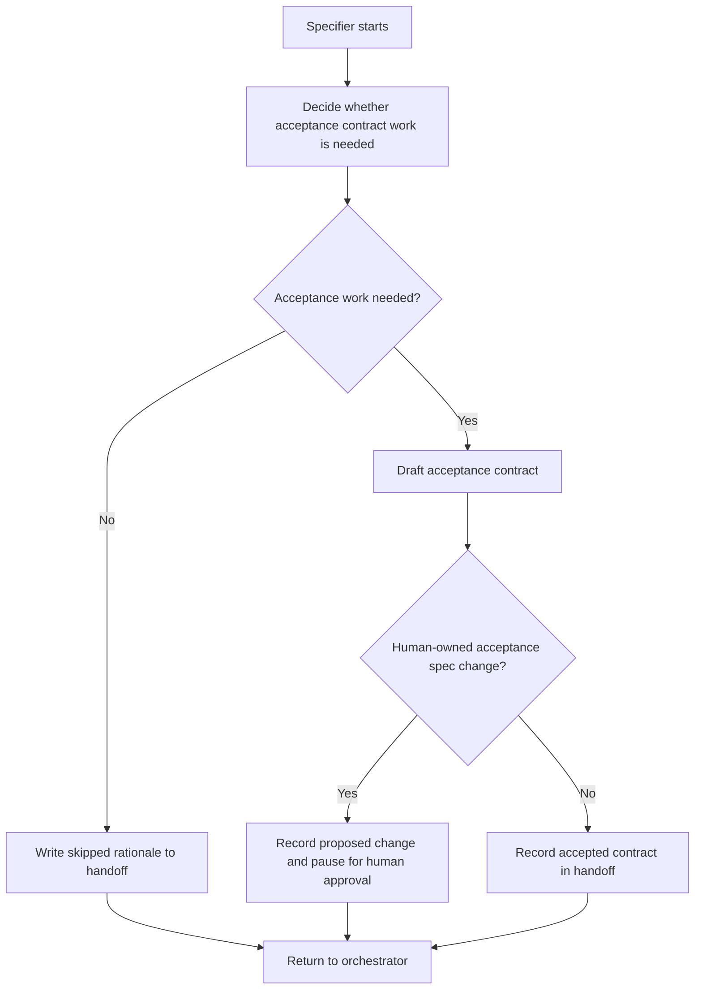

# Specifier Loop

The Specifier turns informal intent into an acceptance contract for one loop
run.

## Inputs

- Trello card, bug report, or explicit user request
- `AGENTS.md`
- `CONTEXT.md`
- relevant ADRs and domain docs
- existing acceptance specs under `packages/extension/tests/acceptance/specs/`
- `docs/agents/acceptance-specs.md`
- current handoff file

## Owns

- deciding whether acceptance work is needed
- drafting acceptance scenarios or contract notes
- pruning acceptance scenarios to the smallest useful behavior contract
- identifying human-owned spec Markdown changes
- recording human acceptance gates in the handoff log

## Does Not Own

- committing acceptance spec Markdown without explicit human approval
- pushing the branch forward while acceptance approval is pending
- implementing step bindings, generated Playwright files, unit tests, or
  production code
- routing the next role

## Loop

## Progress

Measurable progress includes:

- acceptance scope shrinking
- unclear behavior turning into explicit acceptance notes
- proposed scenarios becoming more testable
- human questions becoming concrete decisions

After three consecutive flat or regressing passes, stop and request human
review.

## Handoff Entry

The Specifier handoff entry must include:

- result: skipped, needs human acceptance, or acceptance contract ready
- acceptance draft or approved contract
- files read
- files changed, if any
- human approval status
- open questions

Do not recommend the next role. Return to the orchestrator.
