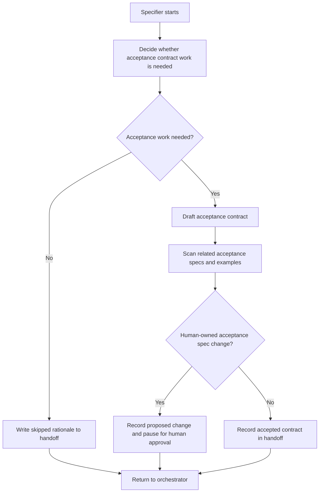

# Specifier Loop

The Specifier turns informal intent into an acceptance contract for one loop
run.

## Inputs

- Trello card, bug report, or explicit user request
- `AGENTS.md`
- `CONTEXT.md`
- relevant ADRs and domain docs
- existing acceptance specs under `packages/extension/tests/acceptance/specs/`
- `docs/agents/acceptance-specs.md`
- current handoff file

## Owns

- deciding whether acceptance work is needed
- drafting acceptance scenarios or contract notes
- drafting or updating example source files when examples define the acceptance
  contract
- drafting local implementation plans under `docs/plans/` when a plan is needed
  to preserve the selected acceptance direction
- scanning human-owned acceptance specs for references to changed examples,
  fixtures, paths, names, and visible behavior
- pruning acceptance scenarios to the smallest useful behavior contract
- identifying human-owned spec Markdown changes
- recording human acceptance gates in the handoff log

## Does Not Own

- committing acceptance spec Markdown without explicit human approval
- pushing the branch forward while acceptance approval is pending
- implementing step bindings, generated Playwright files, unit tests, or
  production code
- putting card-specific implementation plans under `docs/agents/`
- routing the next role

## Loop

## Progress

Measurable progress includes:

- acceptance scope shrinking
- unclear behavior turning into explicit acceptance notes
- proposed scenarios becoming more testable
- human questions becoming concrete decisions
- stale fixture or example references becoming explicit human review items

## Acceptance Impact Scan

When the work changes an example workspace, fixture, graph counts, visible
controls, file paths, or source names, the Specifier must search all
human-owned acceptance specs for related references before handing work back. It
should identify affected specs, needed local drafts, and specs that are
intentionally unaffected. The Specifier may draft affected Markdown locally, but
normal human-owned acceptance approval rules still apply.

## Handoff Entry

The Specifier handoff entry must include:

- result: skipped, needs human acceptance, or acceptance contract ready
- acceptance draft or approved contract
- plan path under `docs/plans/`, when a plan was drafted
- acceptance impact scan summary when examples or fixtures changed
- example source changes, if examples define the contract
- human approval status
- open questions

Return to the orchestrator.
