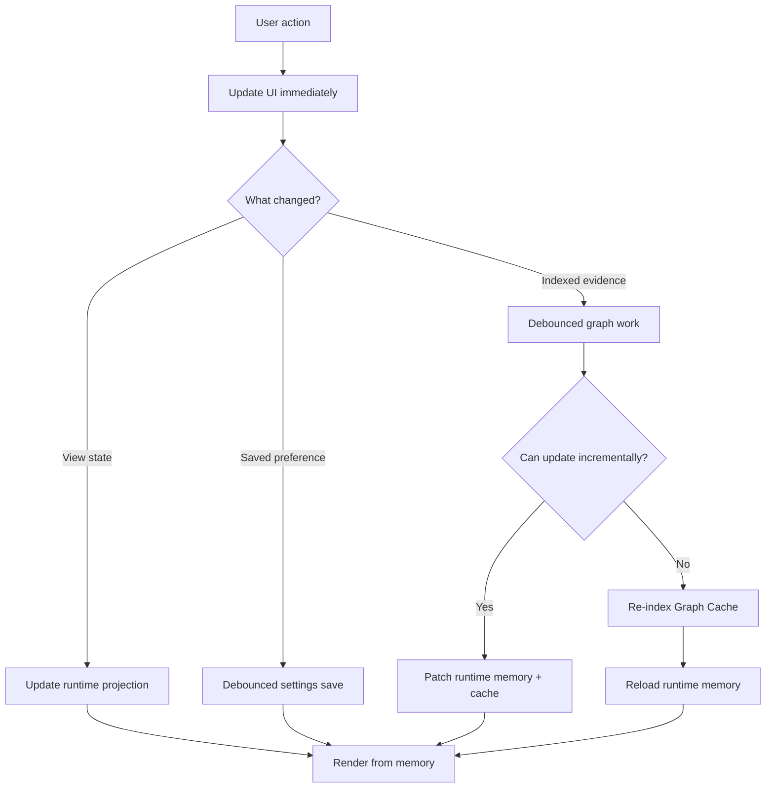
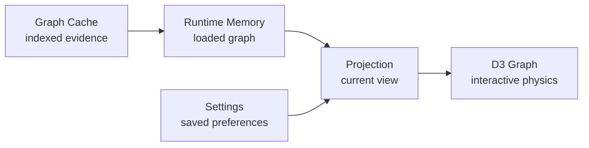
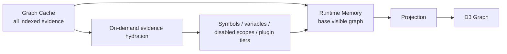

# Graph Cache Runtime Scheduler Notes

## Setup

- Trello card: [Rethink Graph Cache, runtime memory, and update scheduling](https://trello.com/c/sawpINvf)
- Branch: `codex/graph-cache-runtime-scheduler`
- Base: `main` after PR [#294](https://github.com/joesobo/CodeGraphyV4/pull/294)
- Scope: planning notes for a follow-up rearchitecture PR

## Goal

Keep CodeGraphy interaction fast after the PR #294 performance work by separating
indexed graph evidence from runtime view state. The user should be able to toggle
filters, Graph Scope rows, plugin settings, and visual/display preferences quickly
without each click scheduling its own Graph Cache save.

The target model:

- Graph Cache stores durable indexed evidence.
- Runtime memory holds the loaded working graph evidence needed for the current
  view, with additional evidence hydrated from Graph Cache on demand.
- Projection state decides what the user currently sees.
- Settings store lightweight user preferences.
- D3 receives graph data from memory and should not wait on disk persistence for
  ordinary view changes.

## Alignment Decisions

- Plugin impact metadata should be required everywhere. CodeGraphy owns the
  current monorepo plugins, so the implementation should update the Plugin API
  and migrate built-in plugins as examples instead of leaving optional or
  partially guessed plugin behavior.
- Filters, Graph Scope, node visibility, and edge visibility should primarily be
  projection changes. They should update the visible graph from runtime memory
  and settings instead of making Graph Cache stale by default.
- Workspace file changes still need to update the graph and Graph Cache. Adding
  a file should create new graph nodes/edges in the live view and patch those
  indexed changes into Graph Cache without rewriting the whole cache when a
  targeted update is possible.
- Explicit Re-index is a force refresh. It should use the current settings,
  bypass ordinary debounce, supersede pending scheduled graph work, and rebuild
  Graph Cache deterministically.

## Current Problem Shape

The current implementation has several paths where a user action can directly
lead to analysis, plugin sync, or Graph Cache persistence. Each individual path
may be valid in isolation, but rapid bursts can feel like CodeGraphy is saving
each click one at a time.

Examples that should not require full Graph Cache writes by default:

- filters
- node visibility
- edge visibility
- Graph Scope toggles
- visual preferences
- plugin UI settings
- plugin settings that do not change analysis output

Examples that can legitimately require Graph Cache work:

- explicit index or re-index
- core or extension analysis schema changes
- discovery, include, exclude, gitignore, or max-file-limit changes
- plugin version changes
- plugin analysis options that alter generated nodes, edges, symbols, or filters
- missing or stale plugin-owned indexed evidence

## Simplified Architecture

Runtime memory should not have to load every cached node and edge up front. The
Graph Cache can contain all indexed evidence while runtime memory hydrates the
evidence needed for the current projection first.

## Architectural Review Notes

### Intent Classification Must Be A Contract

The scheduler should not grow one-off checks such as a particle-specific branch
or a hard-coded setting key special case. Add one canonical impact policy that
classifies each user action or setting change as:

- `view-state`
- `saved-preference`
- `projection-update`
- `targeted-index-work`
- `full-index-work`

The policy should live at the core/extension boundary where settings, plugin
metadata, Graph Cache freshness, and runtime graph memory can be reasoned about
together.

### Plugins Need Explicit Impact Metadata

Plugin settings are not one bucket. The plugin API likely needs an impact
declaration so plugins can tell CodeGraphy whether a change affects only UI,
runtime projection, plugin-owned analysis, or the whole index.

Likely impact levels:

- `view-only`
- `settings-only`
- `projection-only`
- `reanalyze-plugin-files`
- `requires-full-index`

Conservative fallback: if a plugin cannot declare the impact of an analysis
option, treat it as indexed-evidence-changing rather than silently showing stale
analysis.

The implementation should not keep this fallback as the normal path for built-in
plugins. Update every monorepo plugin to declare impact metadata so third-party
plugin authors have real examples to copy.

### Runtime Memory Can Hydrate Evidence Lazily

Runtime memory does not need to load all Graph Cache evidence on startup. It can
start with the evidence required for the current projection, then hydrate hidden
or disabled tiers only when the user turns them on.

Examples:

- Symbol nodes can remain in Graph Cache until the Symbols Graph Scope row is
  toggled on.
- Variable nodes and variable-related edges can remain in Graph Cache until that
  scope is visible.
- Plugin-owned nodes and edges can remain in Graph Cache until that plugin or
  its graph contribution is enabled.

Once a tier is hydrated into memory, keep it there even if the user toggles it
back off. That keeps first use memory lower while making future toggles fast.

Hydration rules:

- Projection changes should first check runtime memory.
- If the requested evidence tier is missing from memory, load it from Graph
  Cache without scheduling analysis or cache writes.
- Hydrating from Graph Cache must not mark the cache stale.
- If Graph Cache does not contain the requested tier, schedule the appropriate
  targeted analysis lane.
- A full re-index clears and rebuilds the hydration state from the new cache.

### Runtime Memory Needs Versioning

Runtime memory and projection updates must carry generation IDs or equivalent
request versions. If an old async refresh completes after a newer user action,
the old result must not overwrite the latest projection or runtime graph state.

The policy should be latest-state-wins:

- While work is idle, run the newest requested work after debounce.
- While work is active, keep one pending latest snapshot.
- When active work finishes, apply it only if it still matches the latest
  generation.
- If a newer snapshot exists, run one follow-up job for that latest snapshot.

### Graph Cache Should Not Store Current View State

The cache should represent indexed evidence, not the user's current lens over
that evidence. Do not include display-only settings in Graph Cache freshness or
persistence decisions.

Graph Cache should not become stale because of:

- filters
- Graph Scope visibility
- node or edge visibility
- colors
- labels
- visual effects
- panel state
- plugin settings that only affect UI or display

### Incremental Patching Needs Fallback Rules

Incremental refresh should be preferred when it is correct, but the scheduler
must know when a full index is required.

For workspace edits, prefer patching existing runtime memory and Graph Cache:

- new file: analyze the file, add its nodes and edges to runtime memory, and
  patch the Graph Cache entry
- changed file: invalidate old file-owned evidence, analyze the file, update
  runtime memory, and patch the Graph Cache entry
- deleted file: remove file-owned evidence from runtime memory and Graph Cache
- rename or move: update identity/path metadata without full cache rewrite when
  the relationship evidence can be preserved safely

Full-index candidates:

- analysis schema changes
- core cache version changes
- parser or analyzer version changes
- plugin version changes
- broad include or exclude changes
- max-file-limit changes
- discovery policy changes
- plugin settings that alter global relationships

## Deterministic Measurement Plan

Wall-clock timings are useful for final validation, but they are noisy during
architecture work. The primary iteration metrics should be deterministic counts
that can be asserted in unit and integration tests.

### Primary Metric: Graph Cache Save Count

Measure how many Graph Cache save operations are scheduled for a scripted burst.

Expected thresholds:

| Scenario | Actions | Expected Graph Cache saves |
| --- | ---: | ---: |
| Visual/plugin UI setting burst | 10 | 0 |
| Filter burst | 10 | 0 |
| Graph Scope/node/edge visibility burst | 10 | 0 |
| Plugin toggles with cached evidence | 10 | 0 |
| Plugin toggles requiring plugin analysis | 10 | <= 1 |
| Explicit re-index | 1 | 1 |

### Secondary Metric: Index Work Count

Measure how many analysis/index jobs are scheduled for a burst.

Expected thresholds:

- Projection-only bursts schedule 0 index jobs.
- Settings-only bursts schedule 0 index jobs.
- Analysis-affecting plugin bursts schedule at most 1 index job for the latest
  state after debounce.
- Explicit re-index bypasses normal debounce and schedules exactly 1
  authoritative full-index job.

### Secondary Metric: Graph Cache Patch Count

Measure whether workspace edits use targeted cache patches instead of whole-cache
rewrites.

Expected thresholds:

| Scenario | Expected cache patch jobs | Expected full cache rewrites |
| --- | ---: | ---: |
| Add 1 file | 1 | 0 |
| Change 1 file | 1 | 0 |
| Delete 1 file | 1 | 0 |
| Rename 1 file | 1 | 0 unless identity cannot be preserved |
| Explicit re-index | 0 | 1 |

### Secondary Metric: Evidence Hydration Count

Measure how often hidden graph evidence is loaded from Graph Cache into runtime
memory.

Expected thresholds:

| Scenario | Expected cache reads | Expected analysis jobs | Expected cache saves |
| --- | ---: | ---: | ---: |
| Toggle Symbols on first time when cached | 1 | 0 | 0 |
| Toggle Symbols off then on again | 0 | 0 | 0 |
| Toggle plugin evidence on when cached | 1 | 0 | 0 |
| Toggle plugin evidence on when missing | 0 | <= 1 targeted job | <= 1 |

### Secondary Metric: Progress Restart Count

Measure how many user-visible Graph Cache or indexing progress sequences appear
for a burst.

Expected thresholds:

- Projection-only and settings-only bursts show 0 indexing/cache progress
  sequences.
- Analysis-affecting bursts show at most 1 progress sequence per coalesced
  latest-state job.
- No stale progress sequence should restart for superseded work.

### Correctness Metric: Latest-State Wins

Use fake timers and controlled promises to prove stale work cannot overwrite
newer state.

Required assertions:

- A slow first refresh finishing after a newer projection update does not
  rollback the projection.
- Plugin on/off/on during active work applies the final `on` state only.
- A pending settings flush writes the latest settings snapshot, not each
  intermediate value.
- A pending cache refresh persists metadata for the snapshot it actually
  analyzed.
- A lazily hydrated evidence tier remains in memory after being toggled off and
  is reused without another cache read when toggled back on.
- A workspace file patch updates runtime memory and Graph Cache without a full
  Graph Cache rewrite.

### Final User-Perceived Timing Checks

After deterministic counts are correct, run real Extension Development Host
checks against the large CodeGraphy monorepo.

Useful final timing targets:

- projection update visible within roughly one frame to 100ms
- no repeated `Saving Graph Cache` progress bars for projection-only bursts
- plugin analysis bursts show a single compact sync operation
- explicit re-index still reports full progress clearly

## Edge Cases To Preserve

- User toggles a plugin on, off, and on while plugin sync is already running.
- User changes a plugin setting that only affects UI, then changes one that
  affects analysis.
- A targeted plugin refresh discovers files outside the current filtered
  projection.
- A filter hides nodes while a full re-index is running.
- A cache job finishes after newer projection settings were applied.
- The webview closes before a debounced settings save flushes.
- The extension reloads while index work is pending.
- A plugin version changes while old plugin evidence exists in cache.
- Graph Cache is warm but settings changed since the last session.
- User explicitly clicks Re-index during a debounce window.
- File watcher refreshes and user-driven projection changes happen at the same
  time.
- Gitignore or discovery policy changes invalidate runtime memory that a
  projection update was using.
- User toggles a hidden evidence tier on for the first time and Graph Cache has
  the evidence.
- User toggles a hidden evidence tier on for the first time and Graph Cache does
  not have the evidence.
- User toggles a hydrated evidence tier off and on repeatedly.
- User adds a file while filters hide its folder, then later changes filters so
  the file should become visible from runtime memory.
- User renames or moves a file while a projection-only filter update is pending.
- Explicit Re-index starts while a targeted file patch or plugin refresh is
  queued.

## Mistakes To Avoid

- Do not add particle-specific architecture in core or extension.
- Do not let every `updateConfig` imply Graph Cache staleness.
- Do not let Graph Cache freshness depend on display-only settings.
- Do not queue every requested save; queue the latest state.
- Do not hide real index progress; make it less spammy.
- Do not make plugin impact guessable from current behavior only.
- Do not update Graph Cache for projection-only changes.
- Do not let stale async work publish over newer runtime graph memory.
- Do not eagerly load every cached node and edge when the current projection does
  not need them.
- Do not rerun analysis just to hydrate evidence that already exists in Graph
  Cache.
- Do not implement file changes as whole-cache rewrites when targeted cache
  patches are available and correct.

## Acceptance Test Ideas

- Filter changes update projection without saving Graph Cache.
- Node visibility changes update runtime projection without indexing.
- Edge visibility changes update runtime projection without indexing.
- Graph Scope changes update runtime projection without indexing.
- Plugin view setting saves settings but does not reanalyze.
- Plugin analysis setting schedules one coalesced refresh.
- Plugin toggles with cached evidence project in and out without reindexing.
- Plugin impact metadata is required by the Plugin API and present in every
  monorepo plugin.
- Hidden symbol or variable evidence hydrates from Graph Cache on first toggle
  without analysis or cache save.
- Hydrated evidence stays in runtime memory after being toggled off and is reused
  on the next toggle.
- Adding a workspace file patches runtime memory and Graph Cache without full
  cache rewrite.
- Changing a workspace file replaces that file's indexed evidence without full
  cache rewrite.
- Explicit re-index updates Graph Cache immediately.
- Explicit re-index bypasses debounce and supersedes pending graph work.
- Stale async refresh cannot overwrite newer runtime projection.
- Debounced settings persistence flushes on webview dispose or extension
  shutdown.

## Open Design Questions

- What exact plugin API shape should expose impact metadata?
- Should impact metadata live on plugin settings schema, plugin contributions,
  or both?
- Does the required Plugin API metadata change require a major version bump?
- Which current settings belong in Graph Cache freshness and which should move
  to projection/settings-only freshness?
- Which current refresh paths can patch runtime memory safely, and which still
  require full graph rebuilds?
- Which Graph Cache query APIs are needed to hydrate hidden evidence tiers
  without loading the whole cache?
- Which Graph Cache write APIs are needed to patch add/change/delete/rename
  updates without rewriting the whole cache?
- Where should the coordinator live so core, extension, and plugin API boundaries
  stay clean?
