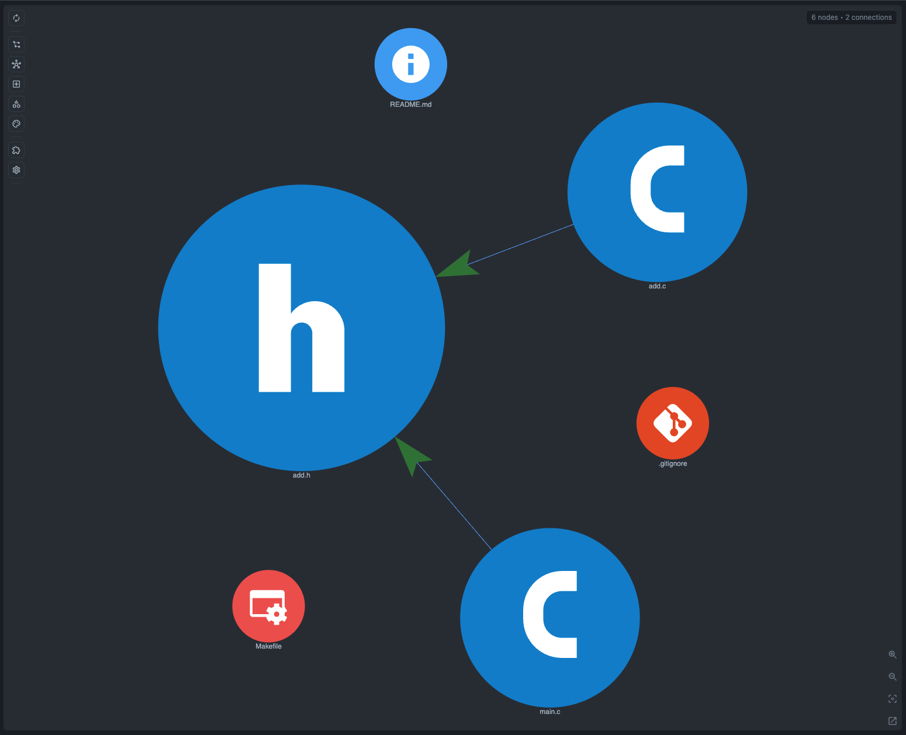

# C Example

This example contains a small logger written in C. Headers define its API and data structures. Source files implement the behavior, and `main.c` uses the logger as a small application would.

CodeGraphy Core reads this project through the Tree-sitter C abstract syntax tree (AST). The graph shows local includes, file-level calls, and common C symbols. These symbols include functions, prototypes, structs, unions, enums, typedefs, and globals. CodeGraphy does not act as a C compiler.

Build and run it with:

```bash
make run
```

## File Graph

Open `examples/example-c` in CodeGraphy and index the workspace. The first graph shows the project as C developers usually navigate it: `.c` files and `.h` files connected by local include edges. From there, Graph Scope can add calls and symbols when you want to move from file structure into declarations.

## Graph Screenshot



## Symbols

Enable symbol node types in Graph Scope when you want to inspect the logger API more closely. Function and prototype nodes show where behavior is declared and implemented, while struct, union, enum, typedef, and global nodes make the small data model visible without leaving the graph.

Because this is Core support, CodeGraphy does not run a preprocessor or compiler for this example. Macro expansion, conditional compilation, external include paths, and type-checked semantic resolution are intentionally left to optional C-specific plugins.
