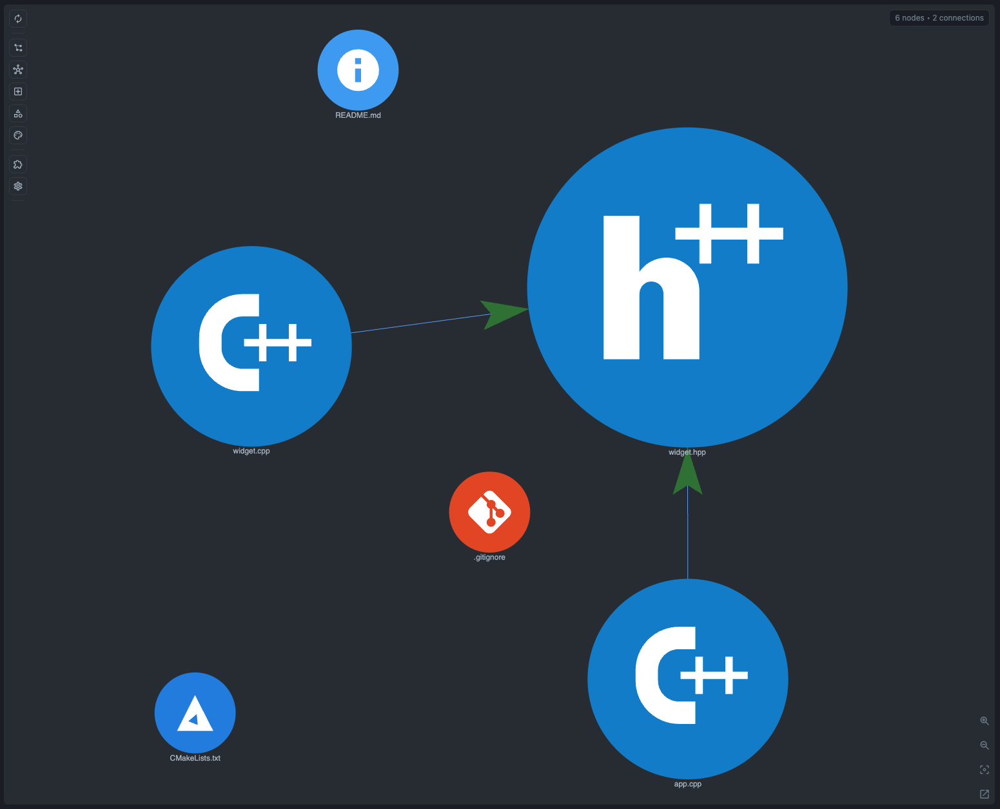

# C++ Example

Tiny C++ project for checking that CodeGraphy connects local includes, class
inheritance, and method overrides.

Open `examples/` in CodeGraphy and look for:

- `example-cpp/src/app.cpp -> example-cpp/src/lib/widget.hpp#import:include`
- `example-cpp/src/lib/widget.cpp -> example-cpp/src/lib/widget.hpp#import:include`
- `Runner -> Widget#inherit`
- `Runner::render -> Widget::render#overrides`

## Graph Screenshot

## Symbol Node Demo

Suggested symbol check:

1. Open `src/app.cpp`.
2. In Graph Scope, enable **Symbol**.
3. Search for `Widget`, `render`, and `make_widget`.

Expected behavior:

- Class and Function symbols show the split between declarations in `widget.hpp` and implementation files.
- `Runner` inherits from `Widget`, and `Runner::render` overrides `Widget::render`.
- Include edges remain the coarse relationship, while symbols make the C++ API surface visible.
