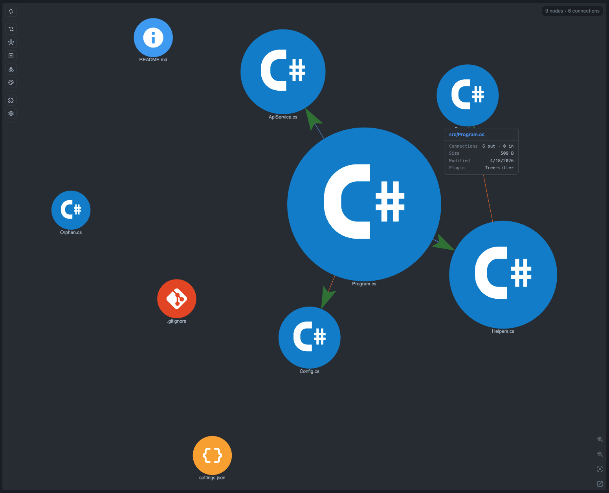

# C# Example

A small C# task dispatch workspace for manual checks of CodeGraphy's C# Core Tree-sitter Language Coverage.

## Graph Screenshot



## Structure

```text
src/
├── Program.cs
├── Config/
│   └── DispatchSettings.cs
├── Contracts/
│   ├── ITaskQueue.cs
│   └── ITaskRunner.cs
├── Events/
│   └── TaskCompleted.cs
├── Models/
│   ├── DispatchResult.cs
│   ├── DispatchTask.cs
│   ├── TaskId.cs
│   └── DispatchStatus.cs
└── Services/
    ├── BaseTaskRunner.cs
    ├── PriorityTaskQueue.cs
    └── TaskDispatcher.cs
```

## Expected Graph Structure

```text
Program.cs
  ├─uses→ Config/DispatchSettings.cs
  ├─uses→ Models/DispatchTask.cs
  ├─uses→ Models/TaskId.cs
  ├─uses→ Models/DispatchStatus.cs
  ├─uses→ Services/PriorityTaskQueue.cs
  └─uses→ Services/TaskDispatcher.cs

Services/TaskDispatcher.cs
  ├─inherits→ Services/BaseTaskRunner.cs
  ├─implements→ Contracts/ITaskRunner.cs
  ├─uses→ Contracts/ITaskQueue.cs
  ├─uses→ Config/DispatchSettings.cs
  ├─uses→ Events/TaskCompleted.cs
  └─uses→ Models/DispatchTask.cs and Models/DispatchResult.cs

Services/PriorityTaskQueue.cs
  ├─implements→ Contracts/ITaskQueue.cs
  └─uses→ Models/DispatchTask.cs

Events/TaskCompleted.cs
  └─uses→ Models/DispatchTask.cs and Models/DispatchResult.cs
```

## Language Features

| Feature | Example |
| --- | --- |
| Class | `TaskDispatcher`, `PriorityTaskQueue`, `BaseTaskRunner`, `DispatchSettings`, `Program` |
| Interface | `ITaskQueue`, `ITaskRunner` |
| Struct | `TaskId` |
| Record | `DispatchTask`, `DispatchResult` |
| Enum | `DispatchStatus` |
| Delegate | `TaskCompleted` |
| Method | `Main`, `Dispatch`, `Enqueue`, `Dequeue`, `Complete`, `BuildMessage` |
| Constructor | `DispatchSettings`, `PriorityTaskQueue`, `TaskDispatcher`, `TaskId`, `BaseTaskRunner` |
| Property | `MaxRetries`, `Count`, `Value` |
| Event | `Completed` |
| Field | `_settings`, `_queue`, `_tasks`, `_value` |
| Parameter | `task`, `settings`, `queue`, `value`, `maxRetries` |
| Constant | `DefaultMaxRetries`, `retryFloor` |
| Local | `settings`, `queue`, `dispatcher`, `task`, `result`, `attempts`, `nextTask` |

## Edge Coverage

| Edge family | Example |
| --- | --- |
| Using | Local namespace imports such as `ExampleCSharp.Models` and `ExampleCSharp.Services` |
| Type | Fields, properties, parameters, return types, records, and delegate signatures reference workspace types |
| Call | `Program.Main` constructs services and calls `Dispatch`; `TaskDispatcher.Dispatch` calls queue and runner methods |
| Inherits | `TaskDispatcher : BaseTaskRunner` |
| Implements | `TaskDispatcher : ITaskRunner`; `PriorityTaskQueue : ITaskQueue` |
| Contains | Files and containing symbols own the visible C# declarations |

## How to Test

1. Open CodeGraphy repo in VS Code.
2. Press F5 to launch Extension Development Host.
3. In the new window: **File -> Open Folder -> examples/example-csharp**.
4. Click the CodeGraphy icon in the activity bar.
5. Compare the graph to the expected structure above.

## Symbol Node Demo

Suggested symbol check:

1. Open `src/Program.cs`.
2. In Graph Scope, enable **Symbol** and **Variable**.
3. Search for `TaskDispatcher`, `DispatchTask`, `TaskId`, `DispatchStatus`, `TaskCompleted`, `Dispatch`, `Completed`, `_queue`, `retryFloor`, and `nextTask`.

Expected behavior:

- File nodes show the task dispatch app structure.
- Symbol nodes expose C# types and members that explain why files connect.
- Enable the C# Variable capabilities to show fields, parameters, constants, and local variables.
