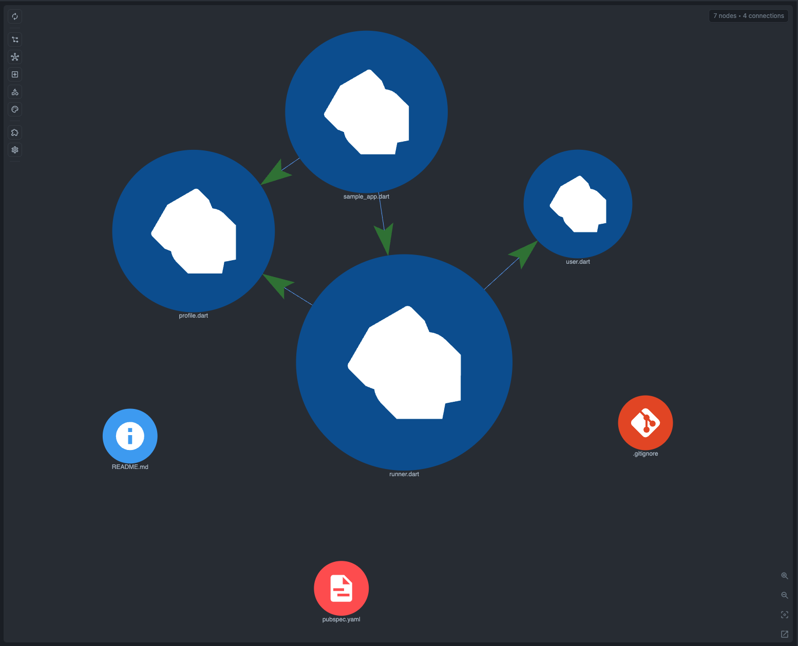

# Dart Example

Small Dart package for checking that CodeGraphy connects a runner entrypoint, app contracts, model types, formatter helpers, and ordinary Dart declarations using syntax-level relationships available from Tree-sitter.

Open `examples/` in CodeGraphy and look for:

- `example-dart/bin/sample_app.dart -> example-dart/lib/app/runner.dart#import`
- `example-dart/bin/sample_app.dart -> example-dart/lib/model/profile.dart#import`
- `example-dart/lib/app/runner.dart -> example-dart/lib/app/base_runner.dart#import`
- `example-dart/lib/app/runner.dart -> example-dart/lib/app/runnable.dart#import`
- `example-dart/lib/app/runner.dart -> example-dart/lib/app/auditable.dart#import`
- `example-dart/lib/app/runner.dart -> example-dart/lib/app/format_run.dart#import`
- `example-dart/lib/app/runner.dart -> example-dart/lib/model/user.dart#import`
- `example-dart/lib/app/runner.dart -> example-dart/lib/model/profile.dart#import`
- `example-dart/lib/app/runner.dart -> example-dart/lib/model/run_status.dart#import`
- `example-dart/lib/app/auditable.dart -> example-dart/lib/model/profile.dart#import`
- `example-dart/lib/app/format_run.dart -> example-dart/lib/model/profile.dart#import`
- `example-dart/lib/app/format_run.dart -> example-dart/lib/model/run_status.dart#import`
- `example-dart/lib/app/runner.dart -> example-dart/lib/app/base_runner.dart#inherit`
- `example-dart/lib/app/runner.dart -> example-dart/lib/app/runnable.dart#inherit`
- `example-dart/lib/app/runner.dart -> example-dart/lib/app/auditable.dart#inherit`
- `example-dart/bin/sample_app.dart -> example-dart/lib/app/runner.dart#call`
- `example-dart/bin/sample_app.dart -> example-dart/lib/model/profile.dart#call`
- `example-dart/lib/app/runner.dart -> example-dart/lib/app/format_run.dart#call`
- `example-dart/lib/app/runner.dart -> example-dart/lib/model/user.dart#call`
- `example-dart/lib/app/runner.dart -> example-dart/lib/app/runner.dart#contains`
- `example-dart/lib/model/user.dart -> example-dart/lib/model/user.dart#contains`
- `example-dart/lib/app/format_run.dart -> example-dart/lib/app/format_run.dart#contains`

## Graph Screenshot

## Symbol Node Demo

Suggested symbol check:

1. Open `lib/app/runner.dart`.
2. In Graph Scope, enable **Function**, **Class**, **Mixin**, **Enum**, **Alias**, **Extension**, **Method**, **Field**, **Parameter**, **Local**, **Constant**, and **Global**.
3. Search for `main`, `boot`, `formatRun`, `Runner`, `Runnable`, `Profile`, `User`, `RunStatus`, `RunLabel`, `ProfileAudit`, `run`, `lastProfileName`, `profile`, `runner`, `statusPrefix`, and `completedRuns`.

Expected behavior:

- Function symbols show the entrypoint, runner boot helper, and formatter helper.
- Class and Mixin symbols show the runner contract and model declarations.
- Enum symbols show the run status model.
- Alias and Extension symbols show Dart-specific syntax that still maps cleanly to generic graph concepts.
- Method, Field, Parameter, Local, Constant, and Global symbols show ordinary declaration sites a Dart developer expects to inspect.
- The Dart import chain becomes a small app story instead of a set of anonymous files.
