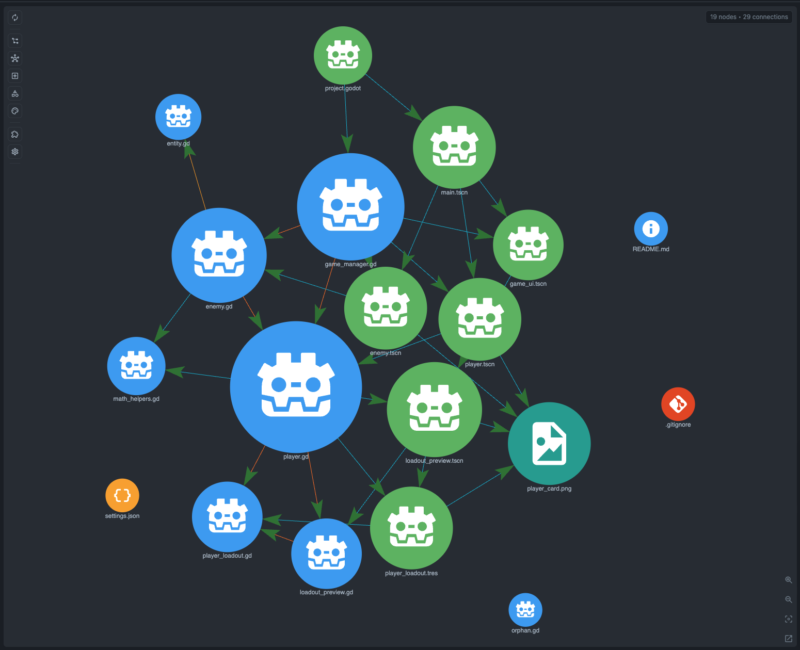

# Godot Example

CodeGraphy's extension-host end-to-end tests use this workspace for the GDScript plugin. You can also open it as a small Godot project in VS Code and try the Graph View.

Project shape:

- `project.godot` boots into `scenes/main.tscn`
- `project.godot` registers `scripts/game_manager.gd` as an autoload singleton
- `scenes/player.tscn`, `scenes/enemy.tscn`, `scenes/projectile.tscn`, and `scenes/ui/game_ui.tscn` make the project feel like a real Godot workspace instead of isolated fixture files
- `scenes/main.tscn` starts the player and enemy on a visible `StaticBody2D` platform with collision shapes, so the example can be run directly in Godot
- `resources/enemy_spawn_config.tres` is a real data resource backed by `scripts/data/spawn_config.gd`
- `scripts/player.gd` and `scripts/enemy.gd` extend `scripts/base/entity.gd`, giving the Godot plugin file-backed inheritance edges distinct from built-in engine class inheritance
- `scripts/base/entity.gd` owns shared `HealthComponent` plumbing while `scripts/player.gd`, `scripts/enemy.gd`, `scripts/projectile.gd`, and `scripts/spawning/enemy_spawner.gd` keep input, chase, projectile, and spawning behavior separated
- `scripts/game_manager.gd` declares `GameSessionManager`, `GameState`, signals, and spawn methods so the graph can demonstrate GDScript enum, variable, function, signal, and `class_name` symbols in one project
- `scripts/ui/game_ui.gd` backs the compact WASD/Shift/Space/click controls UI, while actor-local `HealthBar` nodes display player/enemy health in the world

Suggested Depth Mode check:

1. Open this folder in VS Code.
2. Open `scripts/player.gd`.
3. Run `CodeGraphy: Open`.
4. Turn on Depth Mode.
5. Move the depth slider from `1` to `2`.

Expected behavior:

- Depth `1` shows `scripts/player.gd` plus its immediate GDScript neighbors.
- Depth `2` adds `scripts/base/entity.gd` through the `enemy.gd` relationship.
- `project.godot` is not a universal hub; it only appears when its parsed project settings connect into the visible scene chain.

Suggested scene/resource/project-settings check:

1. Open `project.godot`, `scenes/main.tscn`, or `resources/enemy_spawn_config.tres`.
2. Run `CodeGraphy: Open`.
3. Turn on Depth Mode.

Expected behavior:

- `project.godot` creates static `load` edges to `scenes/main.tscn` from `run/main_scene` and `scripts/game_manager.gd` from `[autoload]`.
- `resources/enemy_spawn_config.tres` creates a static `load` edge to `scripts/data/spawn_config.gd`.
- `scenes/main.tscn` creates static `load` edges to `scripts/main.gd`, `scripts/spawning/enemy_spawner.gd`, `scenes/player.tscn`, `scenes/enemy.tscn`, and `scenes/ui/game_ui.tscn`.
- `scripts/player.gd` creates a static `load` edge to `scenes/projectile.tscn`.
- Those edges come from the Godot plugin's `project-settings` and `ext-resource` sources, not custom Edge Types.
- The `.tscn` and `.tres` files in this fixture use relative `path=` values, and the scene points at the resource with both `uid=` and `path=` so CodeGraphy exercises the same fallback order Godot uses.

## Graph Screenshot

## Symbol Node Demo

Suggested symbol check:

1. Open Graph Scope.
2. Enable **Symbol** and **Variable**.
3. Look for Godot `class_name` symbol nodes such as `Player`, `Enemy`, `Entity`, `Main`, `Projectile`, `EnemySpawner`, `SpawnConfig`, `HealthBar`, and `GameSessionManager`.
4. Toggle **Variable** off and back on.

Expected behavior:

- Godot `class_name` symbol nodes hide when Variable is off because they are plugin-owned variable-style declaration symbols.
- The individual Godot `class_name` row keeps its saved on/off state when Variable is toggled.
- Relationship edges such as `EnemySpawner -> SpawnConfig` and scene/resource load edges still tell the story of how the runnable project is assembled.
- `Enemy -> Entity` and `Player -> Entity` appear through the `Inherits` edge when Graph Scope enables that edge type.

## Supported Godot Graph Contract

This example defines the Godot graph contract that the plugin tests. Generic CodeGraphy rows cover `Function`, `Enum`, `Constant`, `Variable`, `Loads`, `Inherits`, `References`, `Calls`, and `Contains`. Plugin-owned rows cover `Scene`, `Resource`, `Autoload`, `Scene Node`, `Godot class_name`, `Signal`, `Exported Property`, and `Signal Connections`.

Measured current parser/plugin output for the generic surface:

- 23 displayed file nodes, including `.gitignore` and `.vscode/settings.json`; `.codegraphy/settings.json` remains workspace settings, not a graph node
- 20 Godot-supported files: `.gd`, `.godot`, `.tscn`, and `.tres`
- 25 `Loads` edges from project settings, text-resource `ext_resource` entries, and GDScript `preload`
- 23 parser-emitted `References` edges from `class_name` type usage, which project to 12 visible file-to-file reference edges
- 1 `Calls` edge from `MathHelpers.move_toward_angle`
- 2 `Inherits` edges from `Enemy` and `Player` to `Entity`
- 12 `Godot class_name` symbols
- 48 `Function` symbols
- 76 parser-emitted `Variable` symbols, which collapse to 73 unique visible `Variable` node ids
- 3 `Constant` symbols
- 1 `Enum` symbol

Expected Godot-owned graph surface:

- 5 `Scene` nodes
- 1 `Resource` node
- 1 `Autoload` node
- 30 `Scene Node` nodes
- 8 `Signal` nodes
- 23 `Exported Property` nodes
- 80 `Contains` edges when the Godot-owned node rows plus `Godot class_name` are visible together
- 5 `Signal Connections` edges from the example's `connect(...)` calls

Expected plugin-owned Godot coverage:

- `.tscn` files produce `Scene` nodes and `Scene Node` children for root and nested scene nodes.
- `.tres` files produce `Resource` nodes.
- `project.godot` `[autoload]` entries produce `Autoload` nodes.
- `signal` declarations produce `Signal` nodes.
- Inline and standalone `@export` declarations produce `Exported Property` nodes.
- Scene node ownership, script ownership, signal ownership, and exported property ownership use `Contains`.
- Resolvable signal `connect(...)` calls use `Signal Connections`.
