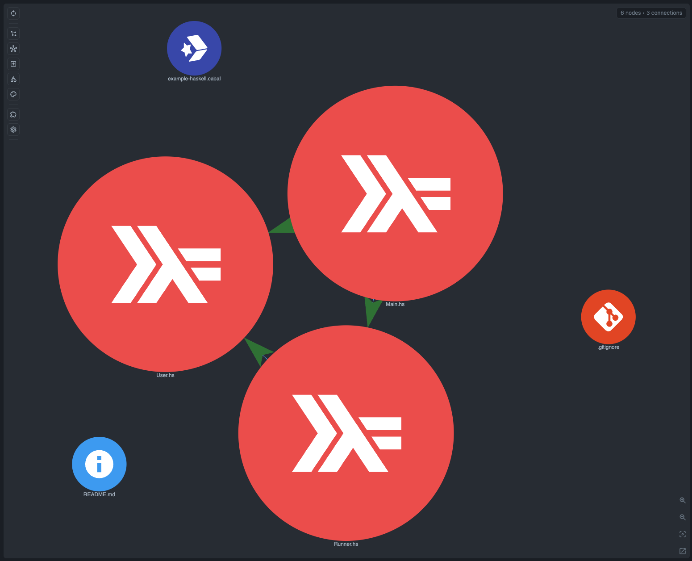

# Haskell Example

A small Cabal/Haskell project for checking that CodeGraphy can show a believable module graph plus the generic symbol concepts currently supportable from Tree-sitter.

## Structure

```
src/
├── Main.hs                  # Entry point
└── App/
    ├── Feature/
    │   └── Runner.hs        # Runner data type, typeclass, and functions
    └── Model/
        ├── Profile.hs       # Profile data type
        └── User.hs          # User data type and constructor helper
```

## Expected Graph Structure

```
Main.hs ─────┬──▶ App/Feature/Runner.hs
             ├──▶ App/Model/User.hs
             └──▶ App/Model/Profile.hs

App/Feature/Runner.hs ──▶ App/Model/User.hs
App/Feature/Runner.hs ──▶ App/Model/Profile.hs
```

## Supported Haskell Coverage

This example intentionally sticks to the Haskell relationships and symbols that CodeGraphy can support from the current Tree-sitter parser surface:

- Imports: module imports between local `.hs` files.
- Calls: calls to imported functions and constructors.
- Functions: `greet`, `boot`, `renderGreeting`, `makeUser`, `describeUser`, and `describeProfile`.
- Types: `Greeting`, `Runner`, `RunnerId`, `User`, and `Profile`.
- Class: `Runnable`.

Out of scope for this card: variables, local binds, record fields as variables, typeclass instance relationships, deriving relationships, and general type references. Tree-sitter exposes syntax for some of those constructs, but CodeGraphy does not currently have reliable generic analyzer support for them.

## Graph Screenshot



## Symbol Node Demo

Suggested symbol check:

1. Open `src/App/Feature/Runner.hs`.
2. In Graph Scope, enable **Symbol**.
3. Search for `Greeting`, `Runner`, `RunnerId`, `Runnable`, `boot`, `renderGreeting`, and `describeUser`.

Expected behavior:

- Function, Type, and Class symbols give the module import chain meaningful endpoints.
- The file graph stays small, while symbol nodes explain why `Main.hs` and `Runner.hs` reach the model files.
