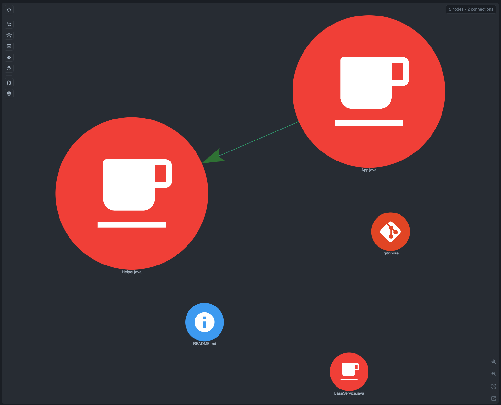

# Java Example

Small Java workspace for manual checks of the core Tree-sitter pipeline.

What to look for:

- import edges
- class and method symbols
- inheritance edges for `extends` and `implements`

## Graph Screenshot

## Symbol Node Demo

Suggested symbol check:

1. Open `src/com/example/app/App.java`.
2. In Graph Scope, enable **Symbol**.
3. Search for `App`, `BaseService`, `RunnableThing`, `Helper`, and `run`.

Expected behavior:

- Class, Interface, and Function symbols show the entry class, inherited base, implemented contract, and helper method.
- Import and inheritance edges stay visible at the file level while symbols expose the Java declarations.
