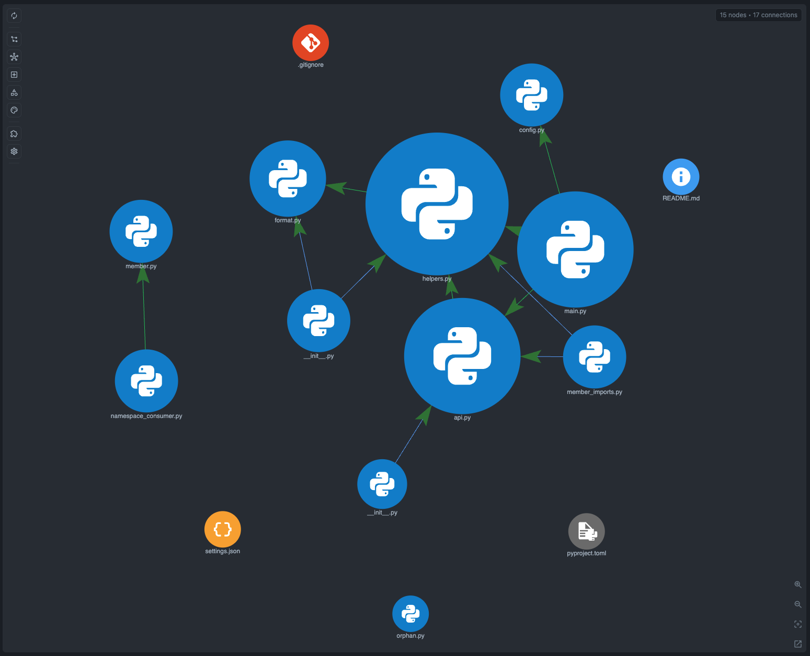

# Python Example

A small Python workspace for manual checks of CodeGraphy's Python support.

## Graph Screenshot



## Structure

```
src/
├── main.py           # Entry point
├── member_imports.py # from pkg import member + unresolved external example
├── namespace_consumer.py
├── config.py         # Configuration
├── orphan.py         # No relationships (test showOrphans)
├── ns_pkg/
│   └── member.py     # Namespace package module (no __init__.py)
├── utils/
│   ├── __init__.py
│   ├── helpers.py    # Utility functions
│   └── format.py     # Formatting utilities
└── services/
    ├── __init__.py
    ├── base.py       # Base API user
    └── api.py        # API service
```

## Expected Graph Structure

```
main.py ──────────────▶ config.py
main.py ──────────────▶ services/api.py ──▶ services/base.py
                         │
                         └──────────────▶ utils/helpers.py ──▶ utils/format.py
main.py ──────────────▶ utils/helpers.py
member_imports.py ───▶ services/api.py
member_imports.py ───▶ utils/helpers.py
namespace_consumer.py ─▶ ns_pkg/member.py

orphan.py (Orphan Node - only visible with showOrphans=true)
```

## Import Patterns Tested

| Pattern | Example | File |
|---------|---------|------|
| Relative import | `from .helpers import ...` | api.py |
| Member import | `from services import api` | member_imports.py |
| Simple import | `import config` | main.py |
| From import | `from utils.format import ...` | helpers.py |
| Namespace package | `from ns_pkg import member` | namespace_consumer.py |
| External unresolved | `from requests import Session` | member_imports.py |
| Inheritance | `class ApiUser(BaseApiUser)` | api.py |

## Files

| File | Imports From | Imported By |
|------|--------------|-------------|
| `main.py` | config, api, helpers | None |
| `member_imports.py` | services/api.py, utils/helpers.py, requests (unresolved) | None |
| `namespace_consumer.py` | ns_pkg/member.py | None |
| `config.py` | None | main |
| `orphan.py` | None | None |
| `ns_pkg/member.py` | None | namespace_consumer |
| `utils/helpers.py` | format | main, api |
| `utils/format.py` | None | helpers |
| `services/api.py` | base, helpers | main |
| `services/base.py` | None | api |

## How to Test

1. Open the CodeGraphy repository in VS Code.
2. Press F5 to launch the Extension Development Host.
3. In the new window, select **File > Open Folder > examples/example-python**.
4. Select the CodeGraphy icon in the Activity Bar.
5. Compare the graph with the expected structure above.

## Symbol Node Demo

Suggested symbol check:

1. Open `src/main.py`.
2. In Graph Scope, enable **Symbol**.
3. Search for `main`, `load_config`, `fetch_user`, `ApiUser`, `BaseApiUser`, and `format_name`.

Expected behavior:

- Function symbols make the import chain readable without opening every file.
- `ApiUser` inherits from `BaseApiUser`, while `main.py` points to the service/config/helper files that make up the runnable path.
