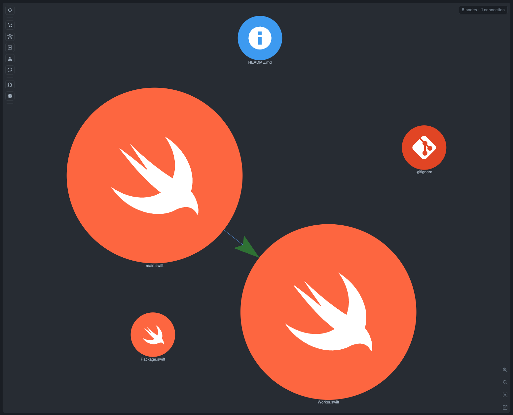

# Swift Example

Tiny Swift Package project for checking that CodeGraphy connects local module imports.

Open `examples/` in CodeGraphy and look for:

- `example-swift/Sources/SwiftExample/main.swift -> example-swift/Sources/RunnerSupport/Worker.swift#import`
- `example-swift/Sources/SwiftExample/main.swift -> example-swift/Sources/RunnerSupport/Runnable.swift#import`
- `example-swift/Sources/SwiftExample/main.swift -> example-swift/Sources/RunnerSupport/Worker.swift#inherit`
- `example-swift/Sources/SwiftExample/main.swift -> example-swift/Sources/RunnerSupport/Runnable.swift#inherit`

## Graph Screenshot

## Symbol Node Demo

Suggested symbol check:

1. Open `Sources/SwiftExample/main.swift`.
2. In Graph Scope, enable **Symbol**.
3. Search for `Runner`, `Worker`, and `Runnable`.

Expected behavior:

- Class and Interface symbols show the local package module API.
- The import and inheritance edges connect the executable target to `RunnerSupport`, while symbols expose the worker and protocol declarations.
