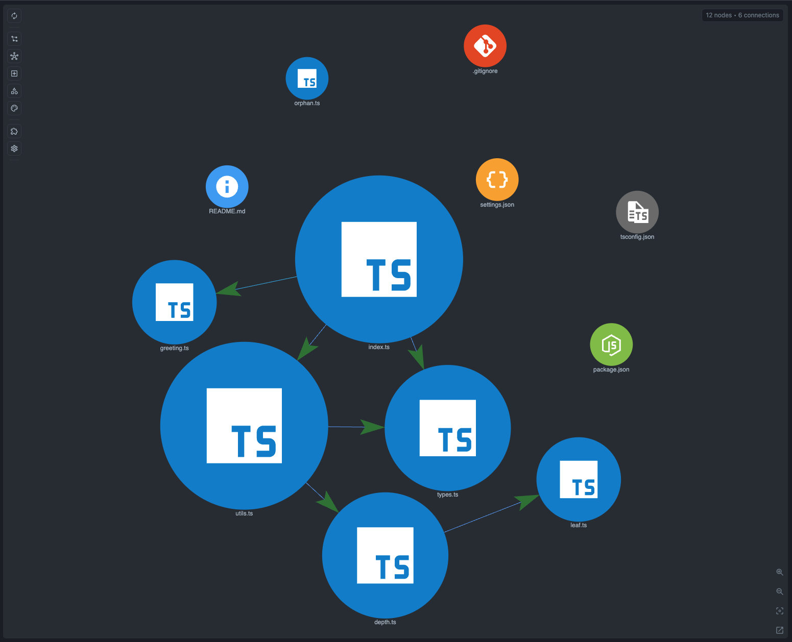

# TypeScript Palette Generator

This runnable TypeScript palette generator demonstrates CodeGraphy's TypeScript graph support. It prints a named palette, loads a theme pack through a TypeScript path alias, reads a legacy CommonJS settings module, and renders a preview through a dynamic import.

```bash
pnpm install
pnpm --dir examples/example-typescript start
pnpm --dir examples/example-typescript build
```

Expected output:

```text
Palette: sunset neon
seed:        #ba6da8
complement:  #6dba7f
analogous A: #a66dba
analogous B: #ba6d82
triadic A:   #a8ba6d
triadic B:   #6da8ba
Loaded theme pack for sunset
theme:sunrise
```

The code is intentionally small, but it behaves like a real project:

- `src/index.ts` is the CLI-style entrypoint.
- `src/palette.ts`, `src/harmony.ts`, and `src/swatches.ts` build hex colors from a seed mood, complementary harmony, analogous neighbors, and triadic accents.
- `src/types.ts` owns the enum, type alias, interface, and mood normalization helper.
- `src/paletteRunner.ts` extends `BaseGenerator` and implements `PaletteExporter`.
- `src/seedSettings.ts` is loaded with `require()` to keep a CommonJS compatibility edge visible.
- `src/lazyPreview.ts` is loaded with dynamic `import()` to show lazy module relationships.
- The `#example/*` TypeScript path alias resolves `src/alias/themePack.ts`.
- `src/scratchpad.ts` is intentionally disconnected so Orphan Node behavior stays obvious.

## Graph Screenshot



## Relationship Demo

Core Tree-sitter Analysis supports this example with 18 file nodes and these rendered edge counts when each edge type is shown by itself:

- **Imports**: 11 connections covering static imports, export-from imports, dynamic imports, and CommonJS `require()`.
- **Type imports**: 6 connections covering top-level type imports and inline type specifiers.
- **Calls**: 6 connections through named imports, a default import, and the palette generation chain.
- **Inherits**: 2 connections from `PaletteRunner` to `BaseGenerator` and `PaletteExporter`.
- **TypeScript Alias Import**: 1 plugin-owned connection from `src/index.ts` to `src/alias/themePack.ts`.

## Symbol Node Demo

Suggested symbol check:

1. Open `src/index.ts`.
2. In Graph Scope, enable **Symbol** and **Variable**.
3. Search for `buildPalette`, `schedulePreview`, `PaletteRunner`, `BaseGenerator`, `PaletteExporter`, `PaletteMood`, `PaletteTheme`, `currentMood`, and `ThemeLabels`.

Expected behavior:

- `buildPalette` appears as a Function symbol imported from `src/palette.ts`.
- `schedulePreview` appears as a Function symbol from an arrow function assigned to a `const`.
- `PaletteRunner` appears as a Class symbol and inherits from `BaseGenerator` and `PaletteExporter`.
- `PaletteExporter` appears as an Interface symbol reached through a type-only import.
- `PaletteMood` appears as a Type symbol and `PaletteTheme` appears as an Enum symbol in `src/types.ts`.
- `currentMood` and `ThemeLabels` appear as Variable nodes, giving the tiny app a file/function/type/value story.

## TypeScript Plugin Alias Demo

The example keeps relative imports for the built-in TypeScript graph behavior and includes a `compilerOptions.paths` alias for the TypeScript plugin:

```json
{
  "compilerOptions": {
    "paths": {
      "#example/*": ["src/alias/*"]
    }
  }
}
```

Suggested alias check:

1. Open this folder in VS Code.
2. Enable the TypeScript plugin.
3. Open `src/index.ts`.
4. In Graph Scope, enable **TypeScript Alias Import**.

Expected behavior:

- `src/index.ts` imports `#example/themePack`.
- The TypeScript plugin resolves that alias to `src/alias/themePack.ts`.
- The original relative-import graph still works when the TypeScript plugin is not enabled.
