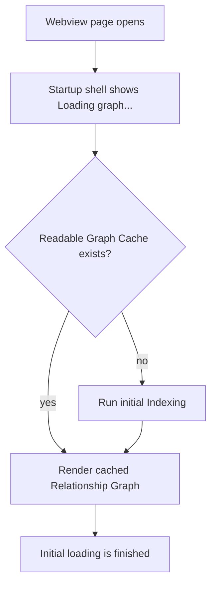

# Graph Cache Lifecycle

The Graph View should prefer a readable **Graph Cache** over a blank loading screen. A stale cache is still useful: it means the cached graph needs **Graph Cache Sync**, not that the graph should be hidden.

## Startup

`Loading graph...` is a webview-page startup state only. It is allowed while the extension has not yet delivered the first graph payload for that page.

Once `Initial loading is finished`, the shell should not return to `Loading graph...` for that page. Later graph work belongs in graph-local progress UI while the current graph remains rendered.

## Graph Cache Sync

**Graph Cache Sync** is the background catch-up pass after a readable cached graph has already been shown. It checks the current runtime inputs against the saved Graph Cache, then updates the cache and the **Visible Graph** when new data is ready.

Inputs that can require sync include:

- enabled plugin packages changing
- plugin signatures or available plugin ids changing
- settings signatures changing
- Graph Cache schema metadata changing
- pending changed files from workspace file events

Sync should be incremental whenever the changed scope is known. Plugin enablement should reprocess plugin-owned files. File saves, creates, renames, and deletes should update the affected file paths. Full Indexing is the fallback for no cache, unreadable cache, incompatible cache, or explicit user re-index.

## Plugin Changes

Package plugin enablement updates workspace settings, reloads workspace plugins, sends the refreshed plugin/control state, then reprocesses files owned by the enabled plugin. This lets the plugin add its nodes, relationships, edge types, decorations, filters, or webview contributions without blocking the whole **Graph View**.

Package plugin disablement updates workspace settings and reloads workspace plugins, but it does not delete plugin-owned data from the Graph Cache. The **Visible Graph** filters disabled or unregistered plugin contributions out at projection time. Keeping the data lets re-enabling the plugin reuse cached work.

Late external plugin registration follows the same rule: initialize the plugin, replay readiness when needed, then reprocess plugin-owned files. It must not clear the Graph Cache.

## Progress UI

The whole-view loading state is only for the first render. After that:

- **Graph Cache Sync** may show graph-local progress.
- **Live Updates** may show graph-local progress.
- **Re-index Workspace** may show graph-local progress.
- Keep the current **Visible Graph**, tool rail, search, panels, and plugin list usable. Disable a specific command only while its work is active.

During a refresh or plugin toggle, users can continue to use the cached graph while CodeGraphy updates it in the background. CodeGraphy replaces the graph payload when the new data is ready.
