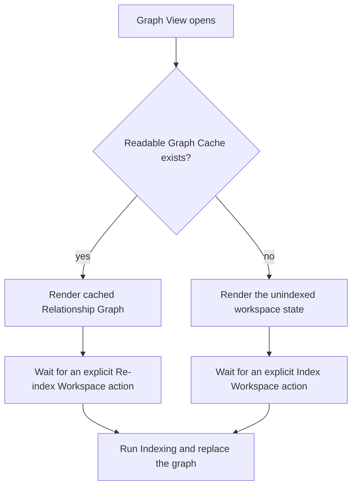

# Graph Cache Lifecycle

The VS Code extension changes workspace source facts only after an explicit **Index Workspace** or **Re-index Workspace** action. This keeps repository analysis off the shared extension host until the user requests it.

## Startup

Opening the Graph View reads the last **Graph Cache** without analyzing source files, initializing source-processing plugins, querying current Git state, or synchronizing stale inputs.

```mermaid
flowchart TD
  A["Graph View opens"] --> B{"Readable Graph Cache exists?"}
  B -->|"yes"| C["Render cached Relationship Graph"]
  B -->|"no"| D["Render the unindexed workspace state"]
  C --> E["Wait for an explicit Re-index Workspace action"]
  D --> F["Wait for an explicit Index Workspace action"]
  E --> G["Run Indexing and replace the graph"]
  F --> G
```

A stale Graph Cache remains visible and useful. Freshness can tell the user that cached facts differ from the workspace, but it does not authorize background Indexing.

## Workspace changes

Saving, creating, changing, deleting, or renaming files does not process source files or alter the cached Relationship Graph. Settings and display actions may re-project already indexed facts; they must not analyze changed source files.

Users choose **Re-index Workspace** when they want the Extension to rediscover files, run built-in and Extension-host plugin analysis, project the complete Relationship Graph, and replace the Graph Cache.

The separate foreground `codegraphy watch` command belongs to the Core CLI. It can maintain the same workspace cache during an explicit terminal session, but the Extension does not launch or own that process.

## Progress UI

The whole-view loading state is only for the first graph payload. During an explicit Index or Re-index Workspace action:

- keep the current graph visible when one exists;
- show graph-local Indexing progress;
- disable only actions that cannot run safely during Indexing;
- replace the graph payload when the new data is ready.

See [ADR 0006](../../../docs/adr/0006-vscode-indexing-requires-explicit-user-action.md) for the decision and its performance rationale.
