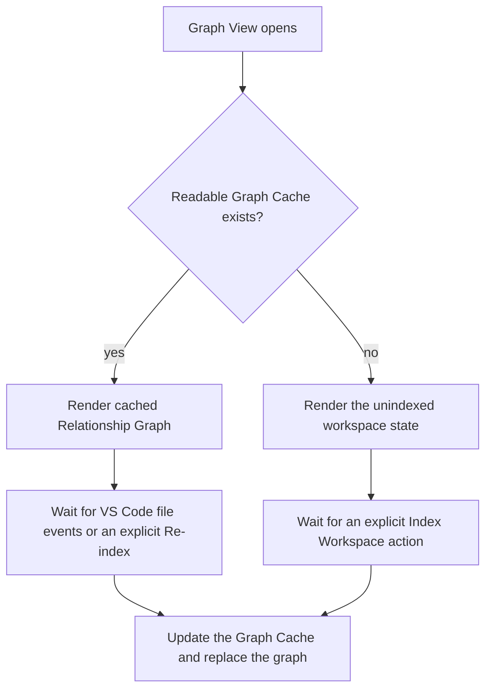

# Graph Cache Lifecycle

The VS Code extension creates workspace source facts only after an explicit **Index Workspace** action. After the first Graph Cache exists, native VS Code file events keep it current through targeted updates.

## Startup

Opening the Graph View reads the last **Graph Cache** without analyzing source files, initializing source-processing plugins, querying current Git state, or synchronizing stale inputs.

```mermaid
flowchart TD
  A["Graph View opens"] --> B{"Readable Graph Cache exists?"}
  B -->|"yes"| C["Render cached Relationship Graph"]
  B -->|"no"| D["Render the unindexed workspace state"]
  C --> E["Wait for VS Code file events or an explicit Re-index"]
  D --> F["Wait for an explicit Index Workspace action"]
  E --> G["Update the Graph Cache and replace the graph"]
  F --> G
```

A stale Graph Cache remains visible and useful. Opening the Graph View does not authorize source analysis. A later native file event can update the existing cache.

## Workspace changes

After the first Graph Cache exists, the Extension responds to editor saves, VS Code file operations, and VS Code file-system events. These events cover changes from the editor, Explorer, integrated terminals, Git operations, and agents. The Extension deduplicates paths, waits 250 ms after the latest ambient event, and starts a batch after at most two seconds. It processes one batch at a time and retains events that arrive during active work.

Graph View create, rename, delete, undo, and redo actions send their exact paths directly to the same targeted Core path. These actions do not wait for the ambient debounce. Core re-analyzes changed files, affected dependents, and plugin-requested paths. Directory-only changes update structural Folder Nodes without source analysis. Generated `.codegraphy` cache files do not trigger another update.

Automatic updates never run full-workspace Indexing. If Core cannot bound the affected paths, the Extension keeps the last consistent graph and marks the index stale. The user can then choose **Re-index Workspace**. An incremental batch waits for an active explicit Index or Re-index operation to finish.

The separate foreground `codegraphy watch` command belongs to the Core CLI. The Extension does not launch that process or subscribe through Core watch mode. VS Code owns the Extension file-system observation lifecycle.

## Progress UI

The whole-view loading state is only for the first graph payload. During an explicit Index or Re-index Workspace action:

- keep the current graph visible when one exists;
- show graph-local Indexing progress;
- disable only actions that cannot run safely during Indexing;
- replace the graph payload when the new data is ready.

The Extension status bar reports queued, updating, and failed cache updates. The existing index status shows when an update needs an explicit Re-index. An idle Extension does not run source analysis or retain update timers.
