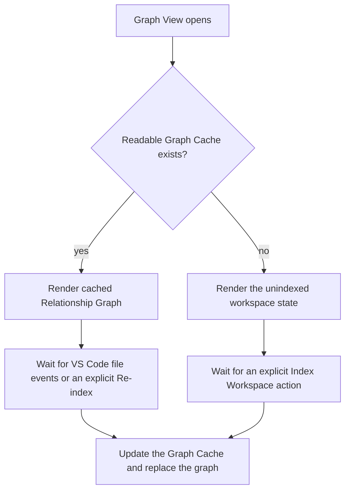

# Graph Cache Lifecycle

The VS Code extension creates workspace source facts only after an explicit **Index Workspace** action. After the first Graph Cache exists, native VS Code file events keep it current through targeted updates.

## Startup

Opening the Graph View reads the last **Graph Cache** without analyzing source files, initializing source-processing plugins, querying current Git state, or synchronizing stale inputs.

```mermaid
flowchart TD
  A["Graph View opens"] --> B{"Readable Graph Cache exists?"}
  B -->|"yes"| C["Render cached Relationship Graph"]
  B -->|"no"| D["Render the unindexed workspace state"]
  C --> E["Wait for VS Code file events or an explicit Re-index"]
  D --> F["Wait for an explicit Index Workspace action"]
  E --> G["Update the Graph Cache and replace the graph"]
  F --> G
```

A stale Graph Cache remains visible and useful. Opening the Graph View does not authorize source analysis. A later native file event can update the existing cache.

## Workspace changes

After the first Graph Cache exists, the Extension responds to native VS Code save, create, delete, and rename events. It deduplicates paths, waits 500 ms after the latest event, and starts a batch after at most two seconds. It processes one batch at a time and retains events that arrive during active work.

Each batch uses the targeted Core refresh path through the existing Extension plugin host. A source-file event refreshes only the affected files. A `.gitignore` or `.codegraphy/settings.json` event can refresh discovery metadata. Generated `.codegraphy` cache files do not trigger another update.

Users can still choose **Re-index Workspace** to rediscover and analyze the complete workspace. A queued file batch waits for an active Re-index to finish before it runs.

The separate foreground `codegraphy watch` command belongs to the Core CLI. The Extension does not launch that process, subscribe through Core watch mode, or poll the workspace.

## Progress UI

The whole-view loading state is only for the first graph payload. During an explicit Index or Re-index Workspace action:

- keep the current graph visible when one exists;
- show graph-local Indexing progress;
- disable only actions that cannot run safely during Indexing;
- replace the graph payload when the new data is ready.

The Extension status bar reports queued, updating, and failed cache updates. An idle Extension does not run source analysis or retain update timers.
